* TOC
{:toc}

# Introduction

NERF gave us a whole new way of approaching general computer vision tasks like
Novel View Synthesis (NVS), 3D Reconstruction, etc. in a more physics informed way.

The NeRF is basically an MLP that learns the 3D density and 5D light field of a given scene from image
observations and corresponding perspective transforms.

Q. What's 5D Light Field?
```
Ans. Choosing any ray (i.e. choosing any starting origin and direction) in the scene,
     we should be able to find the total radiance coming from that ray.
```

Q. What is Radiance?
```
Ans. Measure of Radiant Energy (joules) per unit time, per unit area, per unit solid angle
     AKA: The amount of irradiance per unit solid angle
```

Since the formulation of rendering is crucial to understanding NERFs we'll do that first.

# Part 1 : Volume Rendering

## Understanding Absorption and Trasmittance

### Absorption Emission Model

Let's consider an infinitesimal (small) volume through which we have a light ray travelling.
Now, this volume can do two things:

- Absorb some intensity of incoming light
- Emit some light of it's own

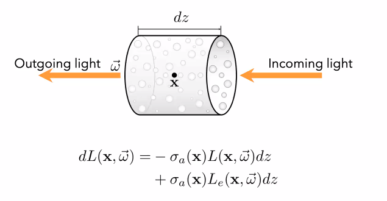

For both cases, we see the factor ```σ``` this is the absorption coefficient of the volume.
Furthermore, we see that **both incoming light and light produced in this volume will be
affected by this ```σ```**

### Absorption-only Model

Modelling only absoroption through a non-homogenous volume, **we derive the relationship
between incoming radiation and outgoing radiation** as follows:

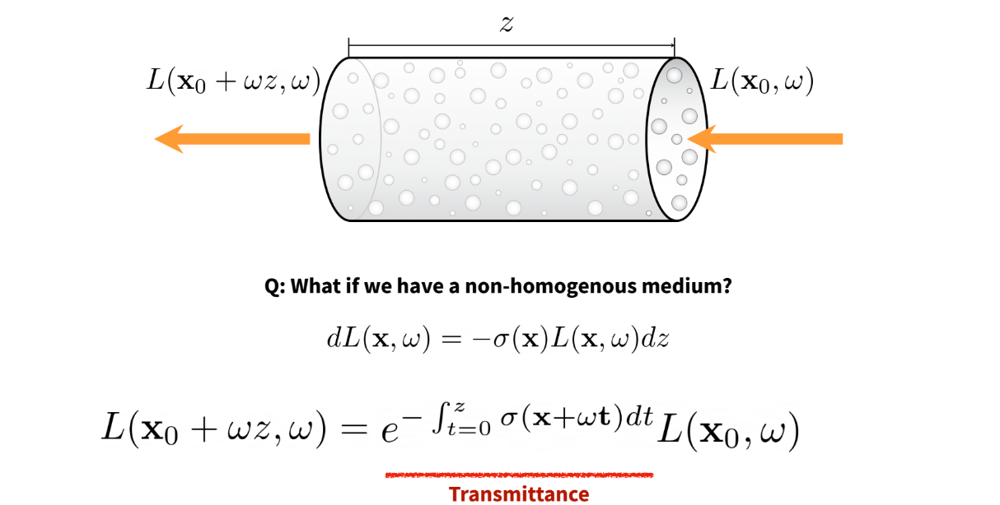

Note in above figure, ```x0``` is where the light ray enters the volume. We assume the volume
is perfectly oriented in the ray's direction ```ω```. Then ```ωz``` would be the length of the
volume along the ```ω``` unit vector. That's why the final radiance output is **```L(x0 + ωz, ω)```**

As you can observe, we have a new term here called **Transmittance**. **The intuitive meaning
of transmittance is the proportion of incoming light that eventually leaves the volume (gets
transmitted).**

Think of it like absorption is a coefficient (say 0.2) meaning that 20% of all incoming light
is absorbed. For transmittance (say 0.8) the intuition would be that 80% of all light is let
through the medium.

### Why The Importance on Transmittance

Trasmittance has some nice properties which simple absorption would not have. Specifically:

- Monotonic Function
- Multiplicativity

In the below picture, we see that even though ```σ``` might vary in the volume, the transmittance
is always a monotonic function:

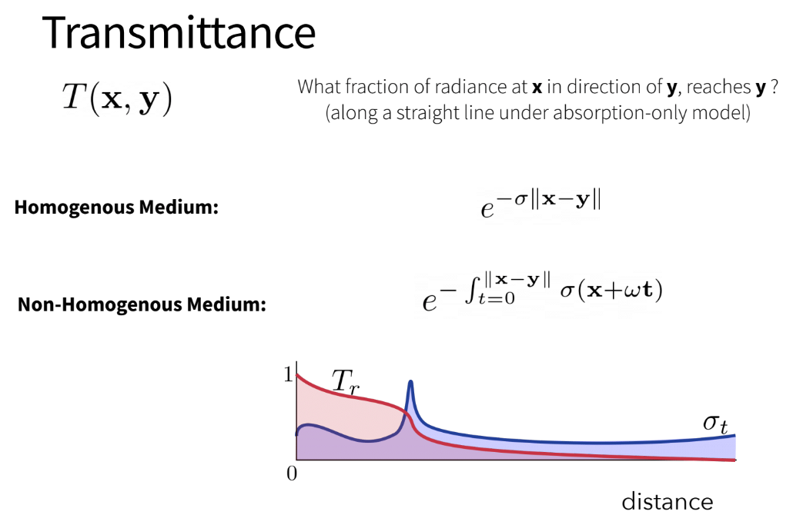

Now, previously we saw Transmittance for a non-homogenous medium. It can be easily adapted
to a homogenous medium as well as shown below:

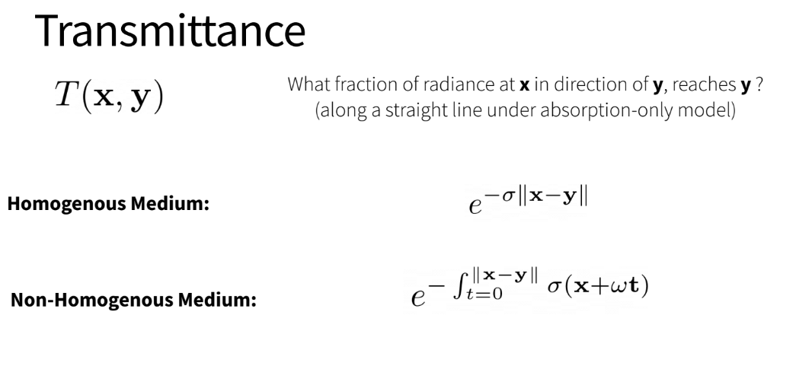

Now, above we see that it's basically an exponential. The **multiplicativity property of
transmittance is due to the this multiplicativity of exponentials**


Using our transmittance terminology above, we finnaly get for **absorption only transmittance**:

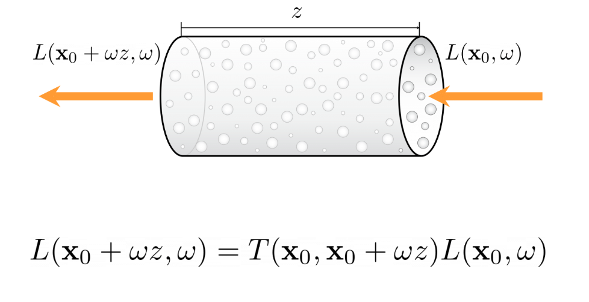


### Emission-Absorption Transmittance

As a recap of what was done above, let's see the basic absorption model

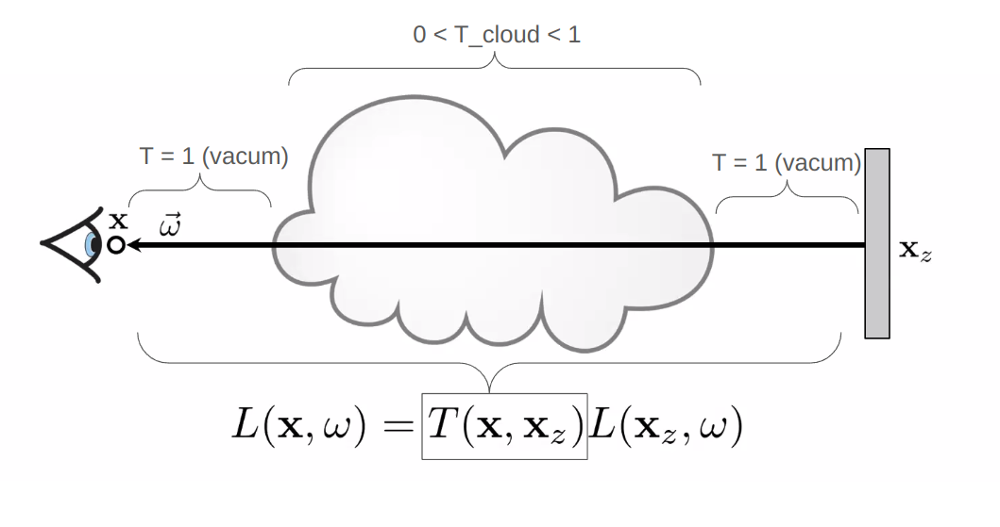

In the above picture note the following:
- The transmittance in vacuum is 1
- Only the cloud has some transmittance value less than 1
- Therefore ```T(x,x_z) = T_cloud``` in the above scenario


**Now, lets make some assumptions to go from absorption only model to absorption-emission model:**
- Let's divide the cloud into small sections (small volumes)
- Let each volume not only absorb (have transmittance < 1) but also be able to emit light
- The final radiation at the eye will be a combination of emission and absorption

The context above is baked into the picture below:


### Ray Marching

Now, the issue with the emission-absorption model is that the integral cannot be solved numerically
without some simplifications. We will make the following simplifications:

- Discretize the space into small volumes
- Let each small volume have it's own ```σ```
- Our final radiation at the eye/camera will be the summation of each of these small volumes


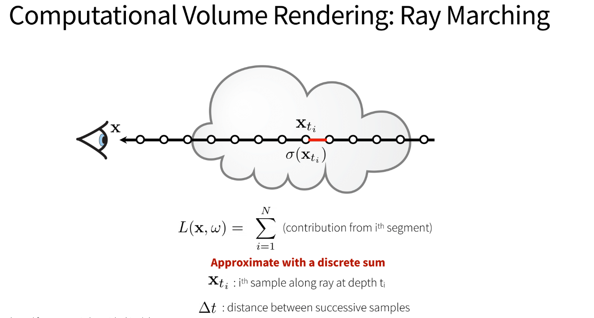


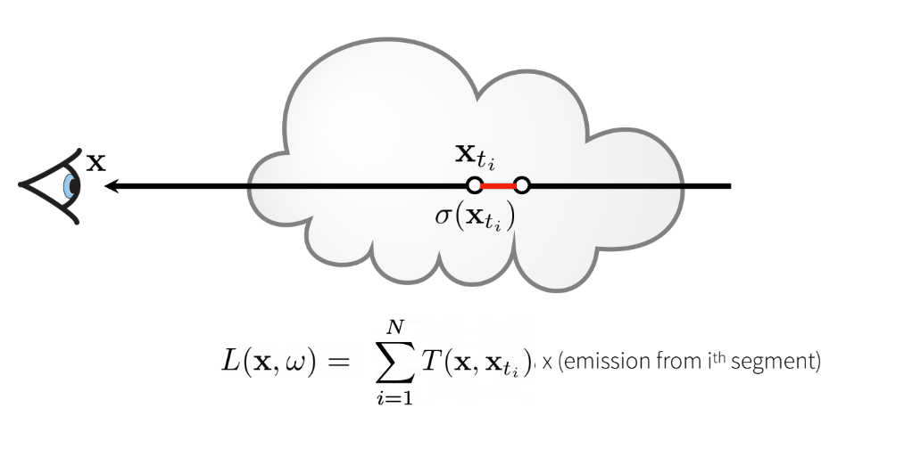


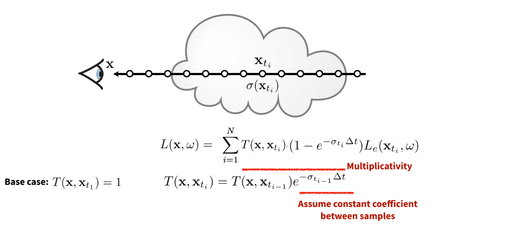


Finally, we see that computing Transmittance is recursive, where the i+1'th segment's
transmittance ```(T_i+1) = T(i) * T(small volume of i+1)```


### Practice Transmittance Calculations

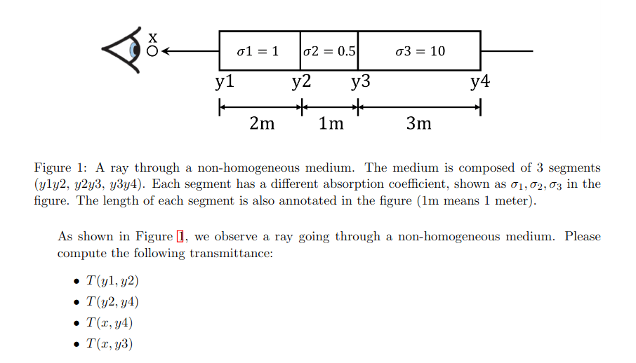

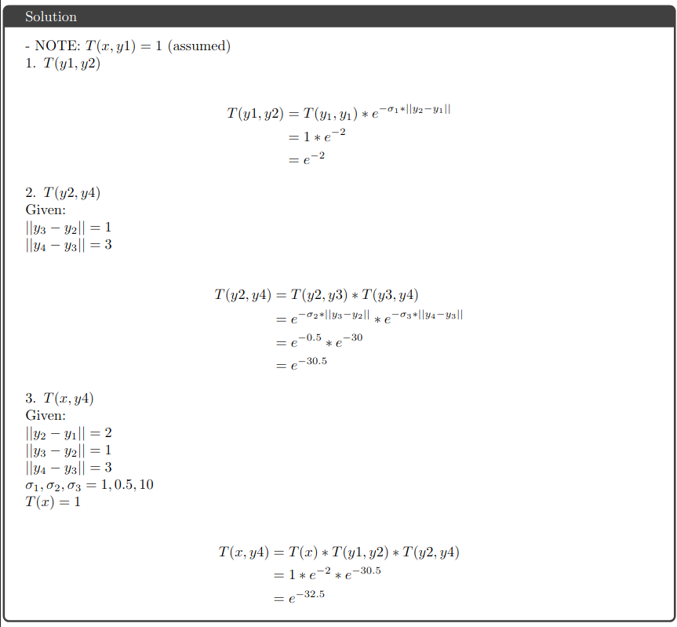

### Implementing Ray Marching

This will be done in two steps:

#### 1. Discretize the space into small volumes (just define the sampling points)

```python
import torch
from ray_utils import RayBundle
from pytorch3d.renderer.cameras import CamerasBase


# Sampler which implements stratified (uniform) point sampling along rays
class StratifiedRaysampler(torch.nn.Module):
    def __init__(
        self,
        cfg
    ):
        super().__init__()

        self.n_pts_per_ray = cfg.n_pts_per_ray
        self.min_depth = cfg.min_depth
        self.max_depth = cfg.max_depth

    def forward(
        self,
        ray_bundle,
    ):
        # Compute z values for self.n_pts_per_ray points uniformly sampled between [near, far]
        z_vals = torch.linspace(self.min_depth, self.max_depth, self.n_pts_per_ray, device=ray_bundle.origins.device)

        # Sample points from z values
        """
        NOTE: if image_plane_points.shape = torch.Size([65536, 3]),
              then rays_origin.shape = torch.Size([65536, 3])
              and sample_lenths.shape = torch.Size([65536, 1, 3])
        """

        origins_expanded = ray_bundle.origins.unsqueeze(1)  # Shape: (N, 1, 3)
        origins_expanded = origins_expanded.expand(-1, self.n_pts_per_ray, -1)  # Shape: (N, D, 3)
        directions_expanded = ray_bundle.directions.unsqueeze(1)  # Shape: (N, 1, 3)
        directions_expanded = directions_expanded.expand(-1, self.n_pts_per_ray, -1)  # Shape: (N, D, 3)
        z_vals_expanded = z_vals.expand(ray_bundle.origins.shape[0], -1).unsqueeze(-1)  # Shape: (1, D, 1)

        new_sample_points = origins_expanded + z_vals_expanded * directions_expanded

        # Return
        return ray_bundle._replace(
            sample_points=new_sample_points,
            sample_lengths=z_vals_expanded * torch.ones_like(new_sample_points[..., :1]), # shape = (N, D, 1)
        )
```

#### 2. Get the density and color of each small volume (This step is Done by the NERF MLP.)

#### 3. Aggregate the density and color of each small volume to get the final color at the origin of each ray


#### NOTE:
During training, density is not explicitly trained for. Instead, we check what the final color
of a ray should be and compare with what the NERF MLP is telling us. This comparison gives us our
loss which will update ray marching.

Because we don't optimize for density directly, that's why the NeRF Depth output is bad. That's
what prompted people to move to Neural SDFs so that geometry would be better optimized.


# Part 2 : NERF Pipeline

## Overview:

- Define a set of rays (origin, direction):
```python
return RayBundle
(
    rays_origin,
    rays_d,
    sample_lengths=torch.zeros_like(rays_origin).unsqueeze(1),
    sample_points=torch.zeros_like(rays_origin).unsqueeze(1),
)
```

- Give rays (origin, direction) to StratifiedRaysampler to get the sample points along the rays
  - i.e. Do the discretization step of Ray Marching
```python
# Sample points along the ray
cur_ray_bundle = StratifiedSampler(cur_ray_bundle)
```

- Pass the sample points to the NERF MLP to get the density and color of each sample point
  - Note: These sample points are anywhere along the rays (think of it like random camera
    positions and randomly close to the object) and we want to predict the density and color
```python
predictions = NeRF_MLP(cur_ray_bundle)
```

**The next two steps are a bit involved**
- Aggregate the density and color of each sample point to get the final color at the origin
  of each ray. (the final color of all rays forms the IMAGE!)
- Compare the final colors (Image) with the GT image to get the loss

Check out the forward function in the Volume Renderer class below reference:

[Reference](https://github.com/sushanthj/L3D/blob/main/HW3/renderer.py)
{: .btn .fs-5 .mb-4 .mb-md-0}


```python
predicted_density_for_all_samples_for_all_rays_in_chunk = NERF_MLP_output['density'] # shape = (self._chunk_size*n_pts, 1) : The density value of that discrete volume
predicted_colors_for_all_samples_for_all_rays_in_chunk = NERF_MLP_output['feature'] # shape = (self._chunk_size*n_pts, 3) : Emittance for each discrete volume for RGB channels

# Compute length of each ray segment
# NOTE: cur_ray_bundle.sample_lengths.shape = (self._chunk_size, n_pts, n_pts)
depth_values = cur_ray_bundle.sample_lengths[..., 0] # depth_values.shape = (self._chunk_size, n_pts)
# deltas are the distance between each sample
deltas = torch.cat(
    (
        depth_values[..., 1:] - depth_values[..., :-1],
        1e10 * torch.ones_like(depth_values[..., :1]),
    ),
    dim=-1,
)[..., None]

# Compute aggregation weights (weights = overall transmittance for all rays in the chunk)
weights = self._compute_weights(
    deltas.view(-1, n_pts, 1), # shape = (self._chunk_size, n_pts, 1)
    predicted_density_for_all_samples_for_all_rays_in_chunk.view(-1, n_pts, 1) # shape = (self._chunk_size, n_pts, 1)
)

# TODO (1.5): Render (color) features using weights
# weights.shape = (self._chunk_size, n_pts, 1)
# color.shape = (self._chunk_size*n_pts, 3)
color_of_all_rays = self._aggregate(weights, predicted_colors_for_all_samples_for_all_rays_in_chunk.view(-1, n_pts, 3)) # feature = RGB color

# TODO (1.5): Render depth map
# depth_values.shape = (self._chunk_size, n_pts)
depth_of_all_rays = self._aggregate(weights, depth_values.view(-1, n_pts, 1))

# Return
cur_out = {
    'feature': color_of_all_rays,
    'depth': depth_of_all_rays,
}
# shape = (N, 3) for feature and (N, 1) for depth
```

The function **compute_weights will find the overall transmittance for each ray** and
**compute_aggregate will use this transmittance to find either color or depth for each ray**

```python
def _compute_weights(
        self,
        deltas,
        rays_density: torch.Tensor,
        eps: float = 1e-10):
        """

        Args:
            deltas : distance between each sample (self._chunk_size, n_pts, 1)
            rays_density (torch.Tensor): (self._chunk_size, n_pts, 1) predicting density values of each sample (from NERF MLP)
            eps (float, optional): Defaults to 1e-10.

        Returns:
            _type_: _description_
        """
        # TODO (1.5): Compute transmittance using the equation described in the README
        num_rays, num_sample_points, _ = deltas.shape
        transmittances = []
        transmittances.append(torch.ones((num_rays, 1)).to(deltas.device)) # first transmittance is 1

        #! Find the transmittance for each discrete volume = T(x, x_i)
        for i in range(1, num_sample_points):
            # recursive formula for transmittance
            transmittances.append(transmittances[i-1] * torch.exp(-rays_density[:, i-1] * deltas[:, i-1] + eps))

        #! Find = T(x, x_t) * (1 - e^{−σ(x) * δx})
        transmittances_stacked = torch.stack(transmittances, dim=1)
        # the below line implements the T(x, x_t) * (1 - e^{−σ(x) * δx}) part of the equation => we'll call this 'weights'
        return transmittances_stacked * (1 - torch.exp(-rays_density*deltas+eps)) # -> weights

    def _aggregate(
        self,
        weights: torch.Tensor,
        rays_feature: torch.Tensor):
        """

        Args:
            weights (torch.Tensor): (self._chunk_size, n_pts, 1) (Overall Transmittance for each ray)
            rays_feature (torch.Tensor): (self._chunk_size*n_pts, 3) feature = color/depth

        Returns:
            feature : Final Attribute (color or depth) for each ray
        """
        # TODO (1.5): Aggregate (weighted sum of) features using weights
        feature = torch.sum((weights*rays_feature), dim=1)
        return feature
```


Basically, compute_weights finds the ```T(x, x_t) * (1 - e^{−σ(x) * δx})``` part of the equation below:


And _aggreate finds the ```L(x,ω)``` which can be color or depth for each ray


## NeRF Training Loop (Simple)

```python
for iteration, batch in t_range:
            image, camera, camera_idx = batch[0].values()
            image = image.cuda().unsqueeze(0)
            camera = camera.cuda()

            # Sample rays
            xy_grid = get_random_pixels_from_image(
                cfg.training.batch_size, cfg.data.image_size, camera
            )
            ray_bundle = get_rays_from_pixels(
                xy_grid, cfg.data.image_size, camera
            )
            rgb_gt = sample_images_at_xy(image, xy_grid)

            # Run model forward
            out = model(ray_bundle)

            # TODO (Q3.1): Calculate loss
            loss = criterion(out['feature'], rgb_gt)

            # Take the training step.
            optimizer.zero_grad()
            loss.backward()
            optimizer.step()
```