* TOC
{:toc}

# Introduction

## Basics

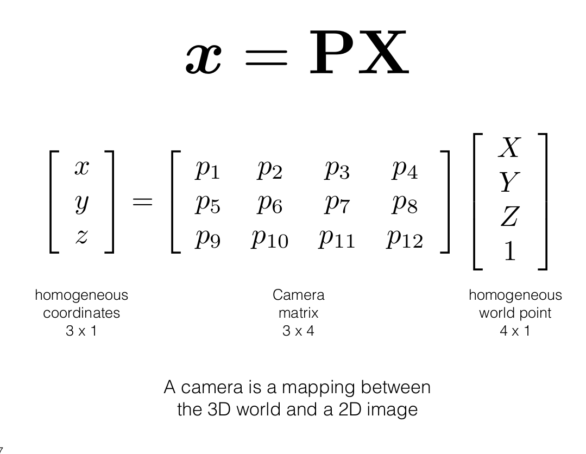

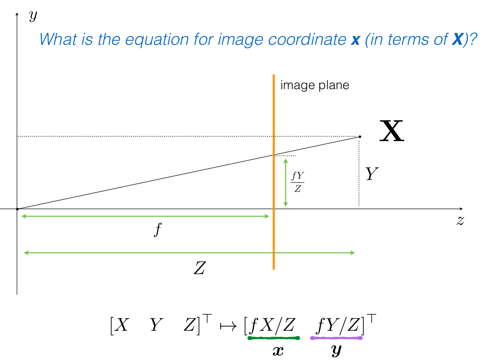

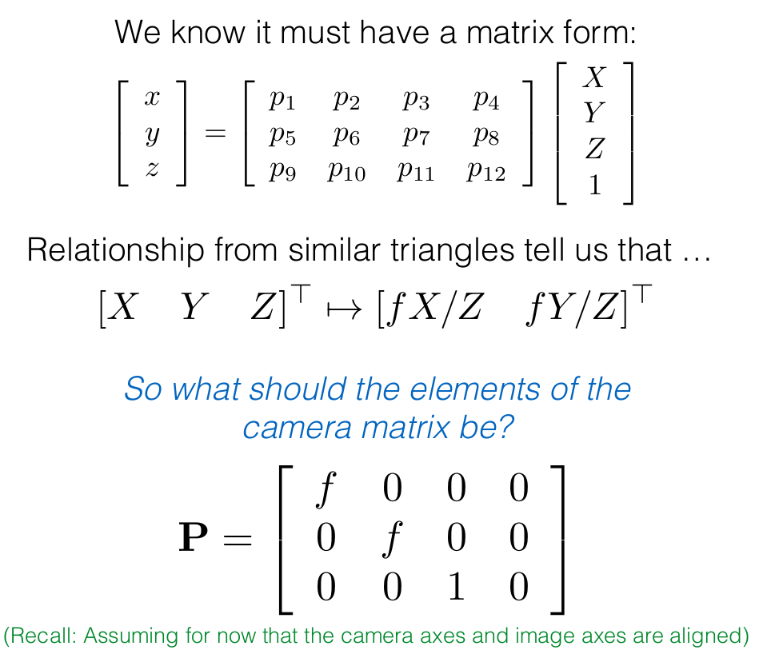

In the above image, the division by Z happens implicitly due to homogenous coordinate notation

## Account for other issues in image frame

**We will introduce 3 coordinate systems below:**
1. Camera Coordinate Frame
2. Image Coordinate Frame (where homogenous notation is used as there is no z-axis information)
3. World Coordinate Information

Sometimes the camera coordinate frame and the image coordinate frame is misaligned as shown below:

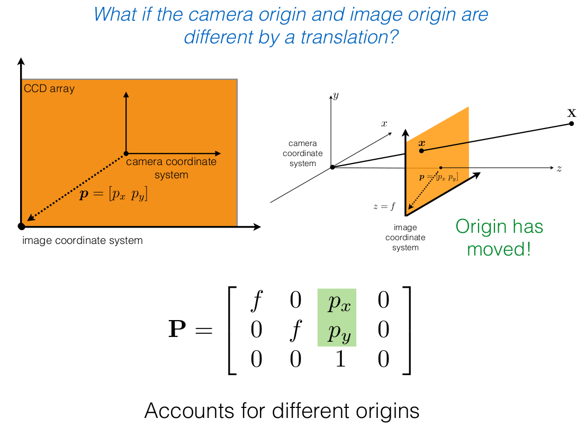

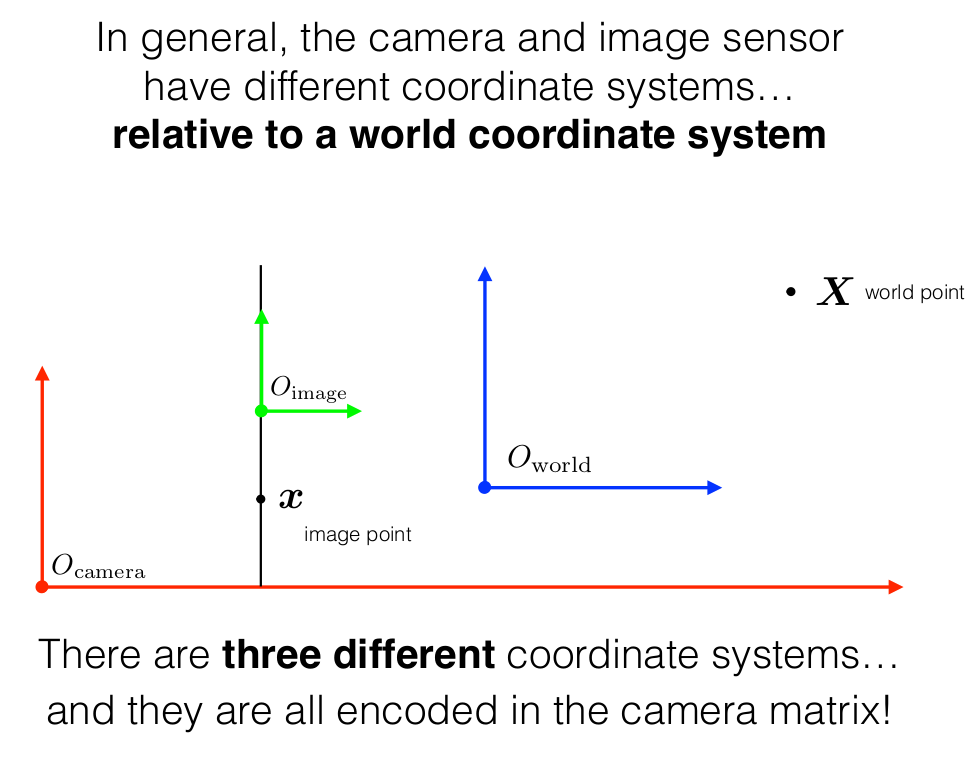

## Intrinsic and Extrinsic Decomposition

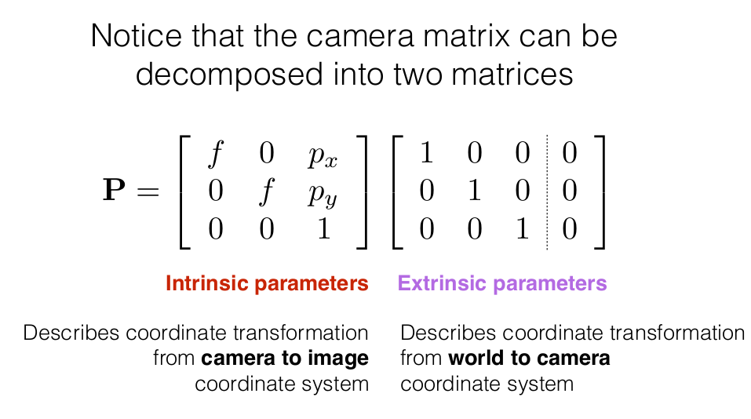

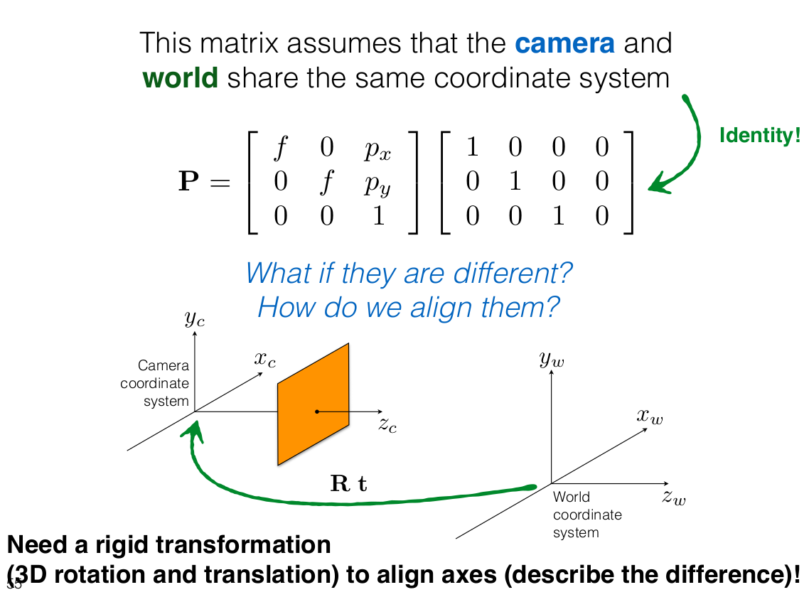

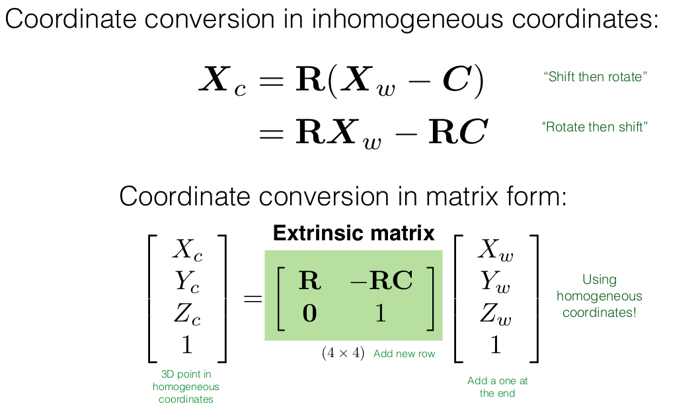

### Lesson Learnt:

If we follow the how a 3D point gets left multiplied by extrinsic and then by intrinsic the
coordinate frame intuition we derive is:

(3D Point -> Extrinsic -> Intrinsic)  =  (World Frame -> Camera Frame -> Image Frame)

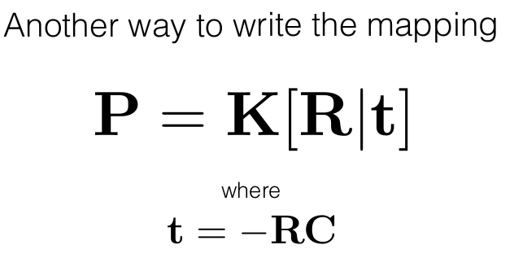

t = Translation (last column of extrinsic matrix)
R = Rotation (first 3x3 part of extrinsic matrix)

## Final Version of Camera Model (I prefer this)

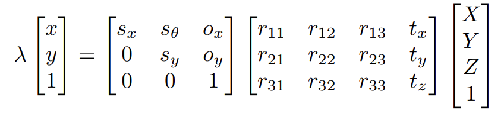

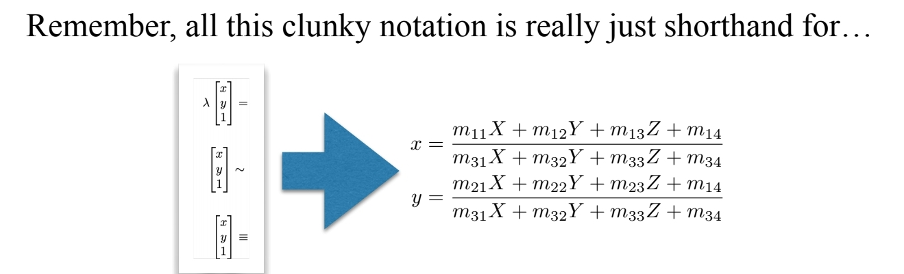