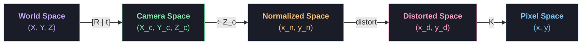
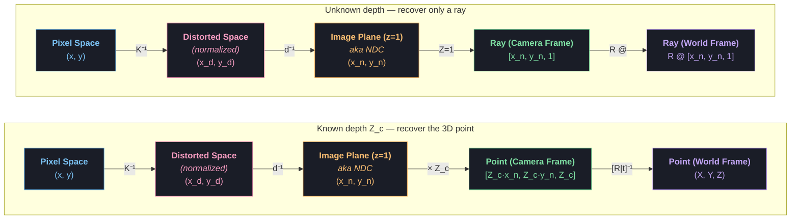

* TOC
{:toc}

# Camera Models

This post covers the classical projection chain: pinhole, intrinsics, the distortion function
$d(\cdot)$, and how to run it backwards. For what modern depth models do *instead* of
undistorting — equirectangular resampling and predicted ray fields — see
[Beyond the Pinhole Camera](/blog/computer-vision/wide-fov-distortion/).

---

## Projection (3D → 2D)

The complete pipeline from a 3D world point to a 2D pixel:




<div style="text-align:center;color:#8b8fa3;font-size:13px;margin:-0.5em 0 2em">Forward projection (3D → 2D): $p = K \cdot d(\pi([R \mid t] \cdot X))$</div>



<div style="text-align:center;color:#8b8fa3;font-size:13px;margin:-0.5em 0 2em">Inverse projection (2D → 3D). Without depth we recover only a ray direction; with depth $Z_c$ we recover the actual 3D point.</div>

---

# Appendix:

## 1. Forward Projection (3D → 2D)

Four stages take a world point to a pixel: the extrinsics re-express it in the camera frame, perspective division flattens it onto the $z = 1$ plane, the lens bends it, and $K$ scales it into pixels.

<video width="100%" autoplay loop muted playsinline>
  <source src="/images/blog/appendix/camera-models/video_forward_projection.mp4" type="video/mp4">
</video>

$$
\lambda \begin{bmatrix} x \\ y \\ 1 \end{bmatrix}
= \underbrace{\begin{bmatrix} f_x & s & c_x \\ 0 & f_y & c_y \\ 0 & 0 & 1 \end{bmatrix}}_{K}
\mathbin{@}
\underbrace{\begin{bmatrix} r_{11} & r_{12} & r_{13} & t_x \\ r_{21} & r_{22} & r_{23} & t_y \\ r_{31} & r_{32} & r_{33} & t_z \end{bmatrix}}_{[R \,|\, t]}
\mathbin{@}
\begin{bmatrix} X \\ Y \\ Z \\ 1 \end{bmatrix}
$$

Or compactly, $p = K \mathbin{@} d(\pi([R \mid t] \mathbin{@} X))$, where $\pi$ is the perspective division and $d(\cdot)$ the lens distortion. Note the matrix form above omits $d(\cdot)$ — distortion is nonlinear and cannot be folded into the product:

---

## 2. Inverse Projection (2D → 3D)

Running the chain backwards recovers a **ray**, not a point. Depth is destroyed by the perspective division, so every point along that ray produces the identical pixel:

<video width="100%" autoplay loop muted playsinline>
  <source src="/images/blog/appendix/camera-models/video_inverse_projection.mp4" type="video/mp4">
</video>

Undoing $K$ is a matrix inverse, but undoing the lens is not — the distortion model has no closed-form inverse and is solved by fixed-point iteration. `cv2.undistortPoints(pts, K, dist_coeffs)` with `P=None` does both and hands back normalized coordinates.

$$
\text{no depth:} \quad P = C + \lambda R \mathbin{@} \begin{bmatrix} x_n \\ y_n \\ 1 \end{bmatrix}, \quad \lambda > 0, \quad C = -R^{\top} \mathbin{@} t
$$

$$
\text{known } Z_c: \quad \begin{bmatrix} X \\ Y \\ Z \end{bmatrix} = [R \mid t]^{-1} \mathbin{@} \begin{bmatrix} Z_c x_n \\ Z_c y_n \\ Z_c \end{bmatrix}
$$

---

## 3. Coordinate Systems

The camera projection model involves three coordinate systems:

1. **World Coordinate Frame** — the global 3D frame in which the scene lives.
2. **Camera Coordinate Frame** — centered at the optical center of the lens, with the z-axis pointing along the optical axis.
3. **Image (Pixel) Coordinate Frame** — the 2D plane onto which 3D points are projected, measured in pixels.


---

## 4. Hand-Eye Calibration

A camera bolted to a robot's wrist has a nominal mounting transform, but tolerances and human error mean the real one is a few millimetres and a degree or two off. Hand-eye calibration recovers it.

### The Setup

We have three transforms:

- $T_{Ref \to End}(i)$ --- from forward kinematics on the joint encoders. **Known.**
- $T_{End \to Cam}$ --- the camera mount. Rigid, but imprecisely known. **This is $X$.**
- $T_{Cam \to Board}(i)$ --- from detecting checkerboard corners and running PnP. **Known.**

We need to find $T_{End \to Cam}$.

<video width="100%" autoplay loop muted playsinline>
  <source src="/images/blog/appendix/camera-models/video_hand_eye_chain.mp4" type="video/mp4">
</video>

Bolt the base and the board down and the chain closes into a loop, so $T_{Ref \to Board}$ is a fixed quantity the arm cannot influence no matter how it moves:

$$
T_{Ref \to Board} \;=\; T_{Ref \to End}(i) \mathbin{@} T_{End \to Cam} \mathbin{@} T_{Cam \to Board}(i) \;=\; \text{constant}
$$

Taking multiple samples we get

$$
T_{Ref \to End}(i) \mathbin{@} T_{End \to Cam} \mathbin{@} T_{Cam \to Board}(i)
\;=\;
T_{Ref \to End}(j) \mathbin{@} T_{End \to Cam} \mathbin{@} T_{Cam \to Board}(j)
$$

Both sides are the same constant, so the unknown mount is trapped between two measured quantities. Peel them off one side at a time.

**Step 1 --- left-multiply both sides by $T_{Ref \to End}(j)^{-1}$:**

$$
T_{Ref \to End}(j)^{-1} \mathbin{@} T_{Ref \to End}(i) \mathbin{@} T_{End \to Cam} \mathbin{@} T_{Cam \to Board}(i)
\;=\;
T_{End \to Cam} \mathbin{@} T_{Cam \to Board}(j)
$$

**Step 2 --- right-multiply both sides by $T_{Cam \to Board}(i)^{-1}$:**

$$
T_{Ref \to End}(j)^{-1} \mathbin{@} T_{Ref \to End}(i) \mathbin{@} T_{End \to Cam}
\;=\;
T_{End \to Cam} \mathbin{@} T_{Cam \to Board}(j) \mathbin{@} T_{Cam \to Board}(i)^{-1}
$$

The unknown now stands alone on both sides, with a purely measured product to its left on one side and to its right on the other. Only now is it worth naming things:

**Step 3 --- substitute:**

$$
A \;\equiv\; T_{Ref \to End}(j)^{-1} \mathbin{@} T_{Ref \to End}(i),
\qquad
B \;\equiv\; T_{Cam \to Board}(j) \mathbin{@} T_{Cam \to Board}(i)^{-1},
\qquad
X \;\equiv\; T_{End \to Cam}
$$

$$
A \mathbin{@} X \;=\; X \mathbin{@} B
$$

which is the classic $AX = XB$ problem: $A$ is the relative end-effector motion between the two poses, $B$ the relative camera motion, and $X$ the mount you want. A single pair leaves $X$ underdetermined, so capture $N \geq 15$ poses with plenty of rotation about different axes and non-coplanar viewpoints. The resulting system is overdetermined and solved as:

```python
R_EndEffector_to_Camera, t_EndEffector_to_Camera = cv2.calibrateHandEye(
    R_robot_to_EndEffector_list,   # list of rotation matrices
    t_robot_to_EndEffector_list,   # list of translation vectors
    R_camera_to_checkerboard_list,
    t_camera_to_checkerboard_list,
    method=cv2.CALIB_HAND_EYE_TSAI  # or PARK, HORAUD, ANDREFF, DANIILIDIS
)
```

### Refining with Reprojection Error (Optional)

Reprojection error measures how well the estimated transforms predict the observed image. For each checkerboard corner:

```
reprojection_error = || projected_2D - detected_2D ||
```

This polishes the closed-form solution, and the residual doubles as your validation metric.

---
