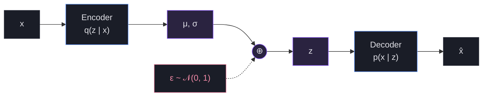

* TOC
{:toc}

## The VAE: bounding $p(x)$ with ELBO



<div style="text-align:center;color:#8b8fa3;font-size:13px;margin:-0.5em 0 2em">The encoder outputs a Gaussian over $z$, not a single point; $z = \mu + \sigma \cdot \epsilon$ is sampled via the reparameterization trick, so gradients still flow.</div>

### The Problem

You have a dataset of images. You want a model that can *generate* new images that look like they belong to the same dataset. To do that, you need to learn $p(x)$ — the probability density over real images.

But $p(x)$ is impossibly hard to compute. An image is a huge vector of pixels. The space of all possible pixel combinations is astronomical, and real images occupy a tiny corner of that space. You need to figure out where that corner is.

### The Idea: Latent Variables

Assume every image was generated from a hidden "recipe" $z$ — a short vector capturing the essence of the image (how cat-like, how bright, what angle, etc). If you knew $z$, generating the image would be straightforward. So:

$$p(x) = \int p(x \mid z) \, p(z) \, dz$$

This is the **law of total probability** (marginalization) — not Bayes' theorem. Bayes would be $p(z \mid x) = \frac{p(x \mid z)\, p(z)}{p(x)}$. The integral above just sums over all possible $z$ values to get the marginal probability of $x$.

The two ingredients on the right side are doing very different jobs — one is a fixed choice, the other is a learned neural network:

$$\textcolor{#f9e2af}{\boldsymbol{p(z) \;=\; \textbf{User Choice} \;=\; \mathcal{N}(0, I)}}$$

$$\textcolor{#f9e2af}{\boldsymbol{p(x \mid z) \;=\; \textbf{Decoder}}}$$

The integral is intractable — you can't sum over all possible $z$ values when $z$ is 512-dimensional.

### ELBO: The Workaround

Since you can't compute $\log p(x)$ directly, derive a lower bound that you *can* compute. Start from the marginal, multiply and divide by a proposal $q(z \mid x)$ (any distribution over $z$), then apply **Jensen's inequality** (since $\log$ is concave, $\log \mathbb{E}[X] \geq \mathbb{E}[\log X]$):

$$
\begin{aligned}
\log p(x)
&= \log \int p(x \mid z)\, p(z) \, dz \\
&= \log \int q(z \mid x) \cdot \frac{p(x \mid z)\, p(z)}{q(z \mid x)} \, dz \\
&= \log \mathbb{E}_{z \sim q(z \mid x)}\!\left[\frac{p(x \mid z)\, p(z)}{q(z \mid x)}\right] \\
&\geq \mathbb{E}_{z \sim q(z \mid x)}\!\left[\log \frac{p(x \mid z)\, p(z)}{q(z \mid x)}\right] \\
&= \underbrace{\mathbb{E}_{z \sim q(z \mid x)}\big[\log p(x \mid z)\big]}_{\text{reconstruction term}} \;-\; \underbrace{D_\text{KL}\big[q(z \mid x) \;\|\; p(z)\big]}_{\text{KL term}}
\end{aligned}
$$

The last step splits the log-ratio: $\log \frac{p(x \mid z)\, p(z)}{q(z \mid x)} = \log p(x \mid z) + \log p(z) - \log q(z \mid x)$, and the last two terms combine into $-D_\text{KL}[q \,\|\, p]$ by definition. The right-hand side is the **ELBO** (Evidence Lower BOund).

There are **three distributions** at play, not two:

| Symbol | What it is | Who provides it |
|---|---|---|
| $q(z \mid x)$ | Encoder: "given image $x$, what latent $z$ probably produced it?" | Neural network (learned) |
| $p(x \mid z)$ | Decoder: "given latent $z$, what image does it produce?" | Neural network (learned) |
| $p(z)$ | Prior: "what do latent codes look like in general?" | You choose this: $\mathcal{N}(0, I)$ |

The **reconstruction term** $\mathbb{E}_{z \sim q(z \mid x)}[\log p(x \mid z)]$ says: sample $z$ from the encoder, decode it, and measure how well it recovers $x$. In practice this is just MSE (Gaussian decoder) or BCE (Bernoulli decoder).

The **KL term** $D_\text{KL}[q(z \mid x) \;\|\; p(z)]$ says: how far is the encoder's distribution from the prior $\mathcal{N}(0, I)$? Both being Gaussian, this has a closed-form solution:

$$D_\text{KL}\!\left[\mathcal{N}(\mu, \sigma^2 I) \;\|\; \mathcal{N}(0, I)\right] = \tfrac{1}{2} \sum_i \left(\mu_i^2 + \sigma_i^2 - \log \sigma_i^2 - 1\right)$$

By maximizing the ELBO, you push $\log p(x)$ upward — your model gets better at assigning high density to real images. The gap between $\log p(x)$ and the ELBO is exactly $D_\text{KL}[q(z \mid x) \,\|\, p(z \mid x)]$, so as the encoder approximates the true posterior, the bound tightens.

### Representation collapse: why the KL term is necessary

If we only optimized the reconstruction term, the encoder would do the simplest possible thing: pick one specific $z$ per image and shrink $\sigma$ toward 0. The animation below shows exactly what goes wrong — and how the KL term pulls the encoder's outputs back into a structured, sampleable latent space.

<div style="position: relative; padding-bottom: 56.25%; height: 0; overflow: hidden; max-width: 100%; margin: 2em 0;">
  <iframe src="https://drive.google.com/file/d/1DySd60ZD3Jh-QAmFgCttEQsZk50L1DBp/preview" style="position: absolute; top: 0; left: 0; width: 100%; height: 100%;" frameborder="0" allow="autoplay; encrypted-media" allowfullscreen></iframe>
</div>

### The Training Loop

```
For each image x:
  1. Encoder: x  →  μ, σ              (output a Gaussian distribution over z)
  2. Sample:  z = μ + σ · ε            (reparameterization trick, ε ~ N(0,1))
  3. Decoder: z  →  x̂                 (reconstruct the image)
  4. Loss = -log p(x̂|z) + KL[q(z|x) || N(0,I)]
  5. Backprop and update weights
```

### The Result

You get a smooth latent space where nearby $z$ values decode to similar images. You can sample $z \sim \mathcal{N}(0, I)$ and decode it to generate new images. The KL term is what makes generation work — it forces the encoder to organize $z$ near $\mathcal{N}(0, I)$, so random samples land in meaningful regions.

> **Key takeaway:** ELBO lets you train a generative model even though $p(x)$ is intractable. The price you pay is that you're optimizing a bound, not the exact thing — so VAE outputs tend to be blurry.
