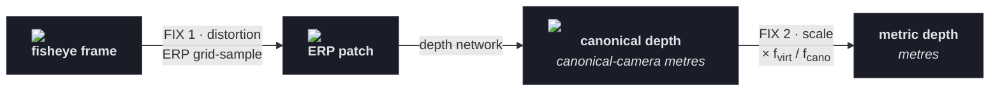
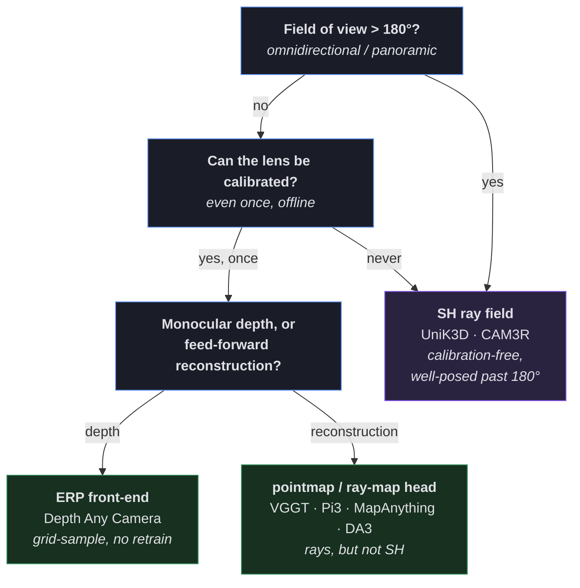

* TOC
{:toc}

# Introduction

The [camera models](/blog/computer-vision/camera-model/) post ends with a pinhole, a matrix
$K$, and a distortion function $d(\cdot)$ bolted onto the side because it refuses to fold into
the matrix product:

$$ p \;=\; K \mathbin{@} d(\pi([R \mid t] \mathbin{@} X)). $$

That $d(\cdot)$ is the awkward one. The classical recipe for dealing with it:

1. Fit a handful of radial and tangential coefficients to a checkerboard.
2. Invert them by fixed-point iteration — there's no closed form.
3. Undistort the image, and carry on pretending you had a pinhole all along.

That works fine at 60°. It falls apart at 140°. It is meaningless at 200°.

Modern depth models don't undistort at all. They change the *representation* so that distortion
never becomes a problem in the first place — and in doing so they split what looks like one
problem into **two separate ones** that people routinely conflate:

| Axis | The problem | The fix |
|:--|:--|:--|
| **Metric scale** | a wide lens and a narrow lens disagree about how many metres a pixel is worth | canonical-focal rescaling |
| **Distortion** | a flat image plane physically cannot hold a wide field of view | resample onto a sphere (ERP), or predict the rays directly (SH) |

I'll call these two things **axes** throughout — meaning two independent *aspects* of the problem
that get fixed by separate mechanisms. Not directions on a graph; nothing here is plotted. The
only thing the word is doing is insisting that these are two problems and not one.

And they really are independent: fixing either leaves the other exactly as it was. That's what
lets you fix them in separate places in the same pipeline, which is where almost every recent
wide-FOV depth paper lands. The rest of this post takes them one at a time, then puts them back
together.

---

# Part 1: The metric axis

## The ambiguity nobody can escape

Monocular depth is ill-posed for a reason that has nothing to do with neural networks:

- A **small nearby object** and a **large faraway object** project to exactly the same pixels.
- Add a second free variable — **focal length** — and it gets worse. A long lens looking at a far
  object and a short lens looking at a near object can be *pixel-for-pixel identical*.

<video width="100%" autoplay loop muted playsinline>
  <source src="/images/blog/computer-vision/beyond-the-pinhole-camera/canonical-focal.mp4" type="video/mp4">
</video>

If the image is the same, a network that only sees the image has no way to know which depth is
correct. This is **metric ambiguity**, and it's what makes "just predict metres" so fragile the
moment you deploy on a camera whose focal length the model never saw.

The source is one line of the projection chain. For a 3D point $X$ at depth $Z$,

$$ u \;=\; f\frac{X}{Z}. $$

Look at the fraction:

- $u$ depends only on the **ratio** $fX/Z$ — never on $f$ and $Z$ separately.
- Scale $f$ up and $Z$ up by the same factor, and $u$ doesn't move at all.
- So the image is **blind** to any change that preserves $fX/Z$.

That's why a network trained at one focal length systematically mis-reads depth at another. It's
a bias baked in by geometry, not by the data.

## The fix: one canonical camera

Metric3D's canonical-space trick is disarmingly simple. Pick one **canonical focal length**
$f_c$ — a single virtual camera that everybody gets mapped into — and define a per-image rescale
factor $\omega$:

$$ \omega \;=\; \frac{f_c}{f}, \qquad Z_c \;=\; \omega Z, \qquad Z \;=\; \frac{1}{\omega}Z_c. $$

As a recipe:

- **Train** the network to predict the rescaled depth $Z_c = (f_c/f)\,Z$, never the raw $Z$.
- **Every image lands in the same virtual camera** before the loss is computed, whatever its
  native focal length — so the network only ever has to learn depth for *one* camera.
- **Undo it at inference** with $Z = (f/f_c)\,Z_c$, using the deployed camera's real $f$.

That's the entire transform: one scalar per image. It's the reason a single model can serve many
focal lengths.

<figure>
  
  <figcaption style="text-align:center;color:#8b8fa3;font-size:13px">
    The same geometry drawn three ways. <strong>Centre:</strong> the original camera — apparent 2D size $u$ is set by the object's 3D size, its depth $Z$, and the focal length $f_x$. <strong>Left:</strong> converting to a canonical model with a different focal length $\hat f_x$ forces a proportional depth rescale, $\hat Z = (\hat f_x/f_x)\,Z$. <strong>Right:</strong> resizing the image to $u'$ simulates viewing the same object from a different distance, so depth scales again as $Z' = uZ/u'$. <em>Figure 3 from Depth Any Camera, arXiv:2501.02464.</em>
  </figcaption>
</figure>

The right-hand panel is worth a second look: **plain image resizing is the same kind of
operation.** Scaling an image is geometrically indistinguishable from moving the object, so any
resize in your data pipeline is silently a depth rescale too. That's a good check on whether
you've internalised the ambiguity — and an easy way to introduce a quiet bug if you haven't.

## Why it's only half the story

Canonical-focal rescaling is a **global similarity on a pinhole camera** — it multiplies depth by
one number for the whole image. So:

- ✅ It fixes **scale**. The systematic bias from a focal-length mismatch disappears.
- ❌ It **cannot represent radial distortion**. A single $\omega$ can't make the periphery of a
  140° lens behave, because the distortion out there isn't a uniform rescale — it's a *per-pixel
  warp*.

Canonical-focal owns exactly one axis. The other needs a different tool entirely.

> **Part 1 in one line.** $u = fX/Z$ means the image only ever sees the *ratio*, so focal length
> and depth trade off invisibly. Rescaling everything to one canonical focal length collapses
> that trade-off into a single virtual camera — fixing scale, but not distortion.

---

# Part 2: The distortion axis

## The pinhole plane runs out of room

Here's the problem in one sentence: **a flat image plane cannot hold a wide field of view.**

Go back to the pinhole relation for a ray at angle $\theta$ off the optical axis. It lands on
the image plane at radius

$$ r \;=\; f\tan\theta. $$

Watch what $\tan\theta$ does as the ray swings outward:

| Ray angle $\theta$ | $\tan\theta$ | What happens on the plane |
|:--|:--|:--|
| 30° | 0.58 | comfortable |
| 60° | 1.73 | already 3× further out than 30° |
| 70° | 2.75 | badly stretched |
| 89° | 57.3 | effectively off the sensor |
| 90° | ∞ | no home at all |

A pinhole has nowhere to put peripheral rays — and a 140° lens is *all* periphery ($\pm 70°$).

<video width="100%" autoplay loop muted playsinline>
  <source src="/images/blog/computer-vision/beyond-the-pinhole-camera/erp-gnomonic.mp4" type="video/mp4">
</video>

This is why a perspective-trained depth model degrades so hard on fisheye input. Two things go
wrong at once:

- It was **never shown** the distorted periphery during training.
- The pinhole representation can't even **express** it — so no amount of extra data fixes this
  on its own.

## What the degradation actually looks like

That's the argument. Here's the measurement — DAC ran a perspective-trained metric depth model
(Metric3D-v2) on the *same scene* presented five different ways:

<figure>
  
  <figcaption style="text-align:center;color:#8b8fa3;font-size:13px">
    One scene, five representations, one perspective-trained model (Metric3D-v2). Top row: input. Middle: predicted metric depth. Bottom: $\delta_1$ accuracy (higher is better). <em>Figure 2 from Depth Any Camera, arXiv:2501.02464.</em>
  </figcaption>
</figure>

Read the $\delta_1$ row left to right — it's the whole motivation for this post in five numbers:

| Representation | FoV | $\delta_1$ | What it tells you |
|:--|:--:|:--:|:--|
| Raw fisheye | 180° | 0.64 | feed the distorted image straight in and the model struggles |
| **ERP** | 180° | **0.76** | same 180° of content, just re-laid-out — and a big chunk of the loss comes back |
| Undistorted perspective | 90° | 0.80 | the best score, but you threw away most of the field of view to get it |
| Undistorted perspective | 120° | 0.66 | pushing the undistortion wider starts to hurt |
| Undistorted perspective | 150° | 0.45 | now it's far worse than just feeding the raw fisheye |

Three things fall out of that table:

- **The "just undistort it" escape hatch works — but only by throwing away FOV.** 0.80 at 90° is
  the best number on the board, and it's the one where you've discarded the wide-angle coverage
  you bought the lens for.
- **Undistorting *wide* is actively counterproductive.** By 150° it scores 0.45, well below the
  0.64 you'd get by not undistorting at all. $r = f\tan\theta$ stretches the periphery so
  violently that the resampled image is worse input than the original.
- **ERP gets most of it back for free.** At the full 180°, ERP scores 0.76 — beating undistorted
  perspective at 120° *and* 150°, using the same model with no retraining. That single comparison
  is the case for the whole distortion axis.

Note what's being measured: this is the **baseline degrading**, not DAC's own result. The model
is perspective-trained throughout; only the input representation changes. Which is precisely why
it isolates the representation effect from the training-data effect.

## Option A: put every ray on a sphere (ERP)

The fix is to stop insisting on a flat plane:

1. Map every pixel to a direction on the **unit sphere** — a latitude $\phi$ and a longitude
   $\lambda$.
2. Unroll that sphere into an **equirectangular projection (ERP)**: a plain 2D grid of
   $(\lambda, \phi)$.

There's no $\tan\theta$ anywhere in that, so nothing blows up. Every ray, however far off-axis,
gets an evenly-spaced cell, and a 140° cone maps to a bounded band of latitudes with room to
spare.

Going the other way — from an ERP cell back to the pixel it came from — uses the **gnomonic
projection** about a tangent centre $(\lambda_c, \phi_c)$:

$$ x_t \;=\; \frac{\cos\phi\,\sin(\lambda-\lambda_c)}{\cos c}, \qquad
   \cos c \;=\; \sin\phi_c\sin\phi + \cos\phi_c\cos\phi\cos(\lambda-\lambda_c). $$

Don't memorise it. Only two properties matter:

- It's **closed-form** — no iteration, unlike inverting a classical distortion model.
- For each cell in the ERP patch, it names the exact floating-point location in the source image
  to interpolate from. In other words, it's just a **grid-sample**.

ERP is a resampling front-end, not a new network.

### The clever bit: fake a fisheye from perspective data

Depth Any Camera (DAC) turns this into a training strategy. Because the gnomonic map is
parameterised by the tangent centre $(\lambda_c, \phi_c)$, you can **tilt** it:

- Set $\lambda_c = 0$ and a perspective patch lands in the low-distortion band, near the equator.
- Set $\lambda_c \neq 0$ and the same patch lands in the **high-distortion band** — exactly the
  region a wide fisheye would observe.

So you can take ordinary perspective training images and, on the fly, project them into
fisheye-like distortion *without owning a fisheye camera*.

<figure>
  
  <figcaption style="text-align:center;color:#8b8fa3;font-size:13px">
    <strong>Top:</strong> the grid-sample itself. Each blue dot is a cell of the ERP patch (left); gnomonic geometry maps it through the unit sphere to a precise location in the source image (right). The patch centre latitude $\lambda$ is set by the camera's pitch — push it off the equator and the sampled patch curves, which is what "high-distortion band" means concretely. <strong>Bottom:</strong> FoV-Align rescales ERP patches of different native FoV (red, green) to one predefined patch size (blue), so a single crop size serves every camera. <em>Figure 5 from Depth Any Camera, arXiv:2501.02464.</em>
  </figcaption>
</figure>

<figure>
  
  <figcaption style="text-align:center;color:#8b8fa3;font-size:13px">
    The DAC pipeline (Guo et&nbsp;al., CVPR&nbsp;2025). Training: perspective images → pitch-aware Image-to-ERP + FoV-Align + multi-resolution augmentation. Inference: any camera → ERP → depth model → optional ERP-to-Image. <em>Figure from the DAC paper, arXiv:2501.02464.</em>
  </figcaption>
</figure>

The whole DAC recipe is three ingredients:

- **Pitch-aware Image-to-ERP conversion** — the tilt trick above.
- **FoV-Align** — normalise every camera's data to one predefined ERP patch size.
- **Multi-resolution augmentation** — so the model survives the train/test resolution gap.

Trained *exclusively on perspective data*, it generalises zero-shot to fisheye and 360°,
improving $\delta_1$ accuracy by up to **50%** over Metric3D-v2 / UniDepth on large-FOV
benchmarks.

### What ERP buys, and what it costs

- ✅ **Cheap.** A grid-sample sitting in front of whatever depth backbone you already have.
- ✅ **Non-invasive.** The entire loss stack — scale-and-shift-invariant loss, gradient matching,
  temporal consistency — is untouched, because from the network's point of view it's still just
  predicting depth on an image.
- ✅ **Free training data.** The tilt trick manufactures fisheye supervision out of perspective
  datasets you already have.
- ❌ **Needs the camera model at test time** to build the patch. For a genuinely uncalibrated
  lens that's a real problem — and it's the opening for the alternative.

## Option B: don't resample, predict the rays (SH ray fields)

UniK3D asks the obvious follow-up: **why resample at all?** Why not let the network predict the
camera's rays directly and skip the intermediate image entirely?

<figure>
  
  <figcaption style="text-align:center;color:#8b8fa3;font-size:13px">
    The pitch, stated as a figure: four wildly different camera models — equirectangular, Mei fisheye, Fisheye624, pinhole — into <em>one</em> network, no intrinsics supplied, metric 3D out. Contrast with ERP, where each of those inputs needs its camera model known in order to build the patch. <em>Figure 1 from UniK3D, arXiv:2503.16591.</em>
  </figcaption>
</figure>

<video width="100%" autoplay loop muted playsinline>
  <source src="/images/blog/computer-vision/beyond-the-pinhole-camera/sh-ray-fields.mp4" type="video/mp4">
</video>

Every camera — pinhole, fisheye, 360°, anything — is fully described by its **pencil of rays**:
the map from each pixel to the 3D direction it looks along.

- A **pinhole's** rays fan out mildly.
- A **fisheye's** bend sharply at the edges.
- If you know the ray field, you know the camera. No intrinsics required.

UniK3D predicts that ray field as a learned superposition of **spherical harmonics**. An angular
module emits a small set of coefficients $\mathbf{H}$, and ray directions come back via an
inverse spherical-harmonic transform:

$$ \mathbf{C} \;=\; \mathcal{F}_{\mathcal B}^{-1}\{\mathbf H\}
   \;=\; \sum_{l=0}^{L}\sum_{m=-l}^{l} \mathbf H_{lm}\,\mathcal B_{lm}(\theta, \phi). $$

Two things worth pausing on:

- The basis functions $\mathcal B_{lm}$ are **fixed and known** — the low-order "lobes" you see
  in the animation. Only the coefficients $\mathbf H_{lm}$ are predicted.
- A basis up to **degree 3 with no constant term** needs just **15 coefficients** to describe the
  ray field of essentially any camera. That's a remarkably compact way to say "here's how this
  lens bends light."

<figure>
  
  <figcaption style="text-align:center;color:#8b8fa3;font-size:13px">
    UniK3D (Piccinelli et&nbsp;al., CVPR&nbsp;2025). The <strong>Angular Module</strong> turns encoder tokens into 15 SH coefficients → the pencil of rays (angles <strong>C</strong>); the <strong>Radial Module</strong> predicts radial distance <strong>R</strong>, conditioned on the rays. <em>Figure from the UniK3D paper, arXiv:2503.16591.</em>
  </figcaption>
</figure>

### Radial distance, not depth

There's a second, subtler design choice hiding in that figure: UniK3D predicts **radial distance**
along each ray — true Euclidean distance from the camera centre — rather than perpendicular depth
$Z$. Why?

- Past a 90° field of view, **perpendicular depth becomes ill-conditioned**. The $Z$ of a ray
  pointing almost sideways is a strange quantity, and at exactly 90° it's degenerate.
- **Radial distance stays well-behaved** at any angle. It's just "how far along this ray."

That one choice is what keeps the representation **well-posed past 180°**, where both ERP and
pinhole start to break down.

Credit where due, though: this move isn't the SH camp's private insight. DAC makes exactly the
same switch on the ERP side — its depth is "represented as Euclidean Distance from the camera
center rather than Z-buffer format, as the latter is incompatible with spherical projections."
Any spherical representation forces it. What stays genuinely UniK3D's is the part that comes
next: the rays themselves are *predicted*, not given.

### What it costs

Two clear wins over ERP:

- ✅ **Calibration-free at test time.** The network *predicts* the rays, so it needs no
  intrinsics, no rectification, no known camera model. Hand it an image and it figures out the
  lens.
- ✅ **Well-posed beyond 180°.** Radial distance plus spherical rays don't blow up at extreme
  FOV. For genuinely omnidirectional cameras this is decisive.

Neither is free:

- ❌ **Bespoke architecture.** A dedicated angular module, a radial module conditioned on it, a
  spherical-harmonic output space, and a matching asymmetric angular loss.
- ❌ **Different output geometry.** It emits radial 3D, not the affine-invariant depth map most
  video-depth loss stacks are built around.
- ❌ **Not a drop-in.** You can't bolt it onto a depth foundation model as "just a LoRA" — it
  replaces the head *and* the loss geometry.

When those advantages *do* bind, though, the gap is not subtle:

<figure>
  
  <figcaption style="text-align:center;color:#8b8fa3;font-size:13px">
    Four test sets (rows, top to bottom: panoramic → 180° fisheye → Fisheye624 → pinhole) against four methods. Odd rows are absolute-relative error maps (blue is better); even rows are the reconstructed point clouds. The thing to look at is the <em>shape</em> of the point clouds, not just the colour: at large FoV the competing methods contract and bend the scene, while UniK3D keeps walls flat and the layout intact. On the bottom pinhole row everyone does fine — which is the point. <em>Figure 3 from UniK3D, arXiv:2503.16591.</em>
  </figcaption>
</figure>

### Side by side

| | **ERP / gnomonic** | **SH ray field** |
|:--|:--|:--|
| What it is | resampling front-end | learned output representation |
| Touches the backbone? | no — grid-sample in front | yes — replaces head *and* losses |
| Needs intrinsics at test time? | **yes** | no |
| Valid past 180°? | no | **yes** |
| Output | Euclidean distance on the ERP grid — metric after canonical rescale | radial distance + rays |
| Training data | manufacture fisheye from perspective | needs its own regime |
| Representative work | Depth Any Camera | UniK3D, CAM3R |

> **Part 2 in one line.** ERP is a cheap front-end that preserves your whole pipeline; SH rays
> are a more powerful but more invasive rebuild.

---

# Part 3: Putting both fixes in one pipeline

So far the two fixes have been described separately. The natural worry is that they'll fight each
other once you use both. They don't — and it's worth being precise about *why*, because "they're
orthogonal" is the sort of phrase that sounds like an explanation without actually being one.

Here is the whole thing as a single pipeline, with the two fixes marked:

One pass, left to right. ERP straightens the grid before the network ever runs; the network predicts metric depth in the canonical camera; the final multiply converts canonical metres into real metres. Note the ratio: $f_{virt}$, not the lens's $f$ — once the image is in ERP space the lens's focal length is gone, and the rescale uses a virtual focal length read off the ERP grid itself (explained below).

## Why this counts as a "composition"

Composition in the ordinary function-composition sense: two operations applied one after another,
where neither disturbs what the other did. That property isn't automatic — it has to be earned,
and here it's earned by the two fixes rewriting **different variables**.

| | **Fix 1 — ERP grid-sample** | **Fix 2 — canonical rescale** |
|:--|:--|:--|
| What it rewrites | *pixel coordinates* — where each ray lands | *depth values* — what the numbers mean |
| What it leaves alone | the depth numbers (still arbitrary units) | the ray geometry (not one pixel moves) |
| Kind of operation | a per-pixel resampling | a single scalar for the whole image |

That's why the diagram reads left to right with no crossing arrows. ERP re-lays-out the image
and does nothing to put depth into metres; the rescale multiplies the depth map by one number and
does not move a single ray. Apply both and you end up with both fixed — and since neither reads
the other's variable, the order you apply them in genuinely doesn't matter.

That is all "orthogonal" was ever claiming. Not "unrelated", but **disjoint in what they
modify**.

## What DAC actually says about it

Worth being straight about the sourcing here: **DAC has no single figure for this composition** —
the diagram above is mine. The paper splits the two halves across two figures that never meet:

- [Figure 3](#the-fix-one-canonical-camera) shows the depth scaling, with no ERP anywhere in it.
- [Figure 4](#the-clever-bit-fake-a-fisheye-from-perspective-data) shows the ERP pipeline, and its
  inference row — `input → Image-to-ERP → depth model → ERP-to-Image` — doesn't draw the rescale
  step at all.

The composition itself appears once, as a line of prose in the preliminaries: the canonical
depth-scaling operations "are central to the Metric3D pipeline and are integrated into our
ERP-based approach." So it is genuinely how DAC is built — just never drawn in one place.

## The focal length of an image with no lens

There's one detail the compact story skates over, and it's the natural objection to the whole
composition: fix 2 multiplies by a ratio of focal lengths — but *which* focal length? The ERP
patch was built by a grid-sample. Whatever $f$ the original lens had is gone; ERP cells are
indexed by angle, not by any focal length.

DAC's answer is to read a **virtual focal length** off the ERP grid itself:

$$ \frac{1}{f_{virt}} \;=\; \tan\!\left(\frac{\pi}{H_{erp}}\right). $$

That's just the pinhole relation $r = f\tan\theta$ run backwards for a single cell: an ERP image
of height $H_{erp}$ spans 180° of latitude, so one row subtends $\pi/H_{erp}$ radians, and
$f_{virt}$ is the focal length of the pinhole camera for which that angle lands exactly one pixel
from centre. Angular resolution has taken over the role the lens used to play.

The rest is Part 1 verbatim, with $f_{virt}$ standing in for $f$: training depth is scaled by
$f_{cano}/f_{virt}$ (DAC uses $f_{cano} = 519$ indoor and $721$ outdoor, with $H_{erp} = 1400$),
and inference multiplies predictions by $f_{virt}/f_{cano}$ to get metres back. Fisheye inputs
are converted to ERP *first* and scaled through $f_{virt}$ too — the paper notes that trying to
align $f_{cano}$ with a fisheye's post-distortion focal length directly "introduces significant
errors."

Written compactly:

$$ \underbrace{\text{image} \xrightarrow{\;\text{gnomonic grid-sample}\;} \text{ERP patch}}_{\textbf{fix 1: distortion}}
   \;\longrightarrow\; \text{depth net} \;\longrightarrow\;
   \underbrace{\hat Z \xrightarrow{\;\times\, f_{virt}/f_{cano}\;} Z}_{\textbf{fix 2: scale}} $$

What that modularity buys you in practice:

1. **Solve the hard axis first.** Distortion (ERP) is the load-bearing part — it's what lets a
   narrow-FOV-trained model transfer to a wide lens at all.
2. **Add the metric axis only if you need it.** In DAC itself the metric axis is integral, not
   bolted on: the network trains against metric ground truth in canonical space, and the rescale
   is what connects that space back to real metres. But the *pattern* doesn't force the choice on
   you — if your target is affine-invariant, with absolute scale recovered downstream from
   triangulation, LiDAR, or a known baseline, you can train a relative model on ERP patches and
   fix 2 never exists. That's a departure from DAC, not a description of it.
3. **Neither disturbs your losses.** Both are pre/post transforms *around* the network, not
   changes *to* it.

> **Part 3 in one line.** One fix rewrites pixel coordinates, the other rewrites depth values —
> different variables, so neither can undo the other. That's what lets them sit at opposite ends
> of one pipeline and be staged independently.

---

# Part 4: Which one should you reach for?

Three questions decide it. Below 180° and calibratable, the depth path takes ERP and the feed-forward reconstruction path takes a native pointmap or ray-map head; SH rays are for the &gt;180° or never-calibrated branches.

Take the concrete case that motivates most of this work: you train on ~80–90° perspective data
and deploy on a ~140° fisheye. Do you need the spherical-harmonic machinery, or is ERP enough?

**Short answer: ERP is enough, and it's probably the right call.** Four reasons, heaviest first.

1. **140° is comfortably below 180°.** The single biggest reason to prefer SH rays is that radial
   distance plus spherical output stay well-posed *past* 180°. If you never go past it,
   ERP/gnomonic is fully well-posed across the entire cone — the pole-region distortion and
   sample-waste that hurt ERP live *beyond* where your camera ever looks. SH's headline advantage
   simply isn't in play.
2. **ERP is non-invasive; SH rays are a rebuild.** ERP is a grid-sample in front of the backbone,
   so architecture and losses stay untouched. SH replaces the output head and the loss geometry —
   a poor fit for a low-data adaptation regime (LoRA and friends).
3. **The metric axis composes for free.** ERP stacks cleanly with canonical-focal rescaling, so a
   near-metric prior can be added later without touching the front-end. That modularity is what a
   staged, risk-managed plan wants.
4. **Calibration is a one-time cost.** ERP's one real weakness is needing the camera model. But
   you can calibrate the lens once (Kannala–Brandt, or the vendor model) and plug it into the ERP
   front-end **with no retraining** — the design was built for an unseen wide camera, and
   calibration just fills in the last parameter.

## An aside: "rays" does not mean "SH rays"

Worth flagging, because it's an easy conflation. If you're doing feed-forward reconstruction
rather than monocular depth, the reasoning goes: *a pointmap is already ray × distance, so the
ray head belongs inside the network.* The premise is true; the conclusion doesn't follow. Look at
what the field-leading feed-forward reconstructors actually use:

| Model | Camera / geometry representation | SH ray field? |
|:--|:--|:--:|
| **VGGT** | parametric intrinsics/extrinsics + pointmaps | ❌ |
| **Pi3** | pointmaps + poses (reference-free) | ❌ |
| **MapAnything** | dense **ray map** + depth + pose + scale | ❌ |
| **Depth Anything 3** | **depth-ray** (dense depth + ray map) — *beats pointmaps* | ❌ |
| **Wid3R** | camera-model **token** conditioning | ❌ |
| **UniK3D** | **SH ray field** + radial distance | ✅ |
| **CAM3R** | **SH** rays + radial distance | ✅ |

Reading that table:

- MapAnything and DA3 **do** factor geometry through rays — and still avoid spherical harmonics.
  DA3 even reports that its ray-map target *beats* pointmaps.
- "Inside the network" is satisfied by a plain dense ray map, or by raw pointmaps. Neither one is
  SH.
- SH is a niche whose only two payoffs — calibration-free, well-posed past 180° — don't bind on a
  calibratable sub-180° lens.

## When to promote SH rays

The reserve isn't decorative. It's gated on two triggers:

| Trigger | Why SH rays win there |
|:--|:--|
| The lens can **never** be calibrated | calibration-free ray prediction earns its complexity |
| FOV creeps **past ~180°** | ERP degrades; radial + spherical stays well-posed |

Note what's *not* on that list: "we're doing reconstruction instead of depth." That's an
architecture question, not a camera-model question.

There's also a cheap hedge that commits you to neither: **Calibration Tokens**.

<figure>
  
  <figcaption style="text-align:center;color:#8b8fa3;font-size:13px">
    Note the snowflakes — the encoder and decoder are <strong>frozen</strong>. The only trainable thing is the small orange Calibration Token appended to the fisheye image tokens. Supervision is self-generated: synthesise a fisheye view of a perspective image, re-project the fisheye prediction back to the standard view, and make the two depth maps agree. No fisheye ground truth, and no fisheye images, are required. <em>Figure 3 from Calibration Tokens, arXiv:2508.04928.</em>
  </figcaption>
</figure>

- Roughly 8 learned tokens per layer, under 1 MB, sub-millisecond.
- Self-supervised, and requires *no* fisheye training images.
- Hands a perspective-domain model fisheye robustness while keeping the output pinhole.
- **Backward-compatible:** omit the tokens and you get the original perspective model back,
  unchanged — so it costs you nothing on in-domain data.

Useful if you suspect an in-domain perspective model might still win.

---

# Takeaways

- **Two orthogonal problems.** $u = fX/Z$ means focal length and depth trade off invisibly
  (metric axis); $r = f\tan\theta$ means a flat plane can't hold a wide FOV (distortion axis).
  Don't conflate them.
- **Metric axis: canonical-focal rescaling.** $Z_c = (f_c/f)Z$ collapses every camera into one
  virtual camera. One scalar. Fixes scale, cannot touch distortion.
- **Distortion axis, option A: ERP.** A closed-form gnomonic grid-sample front-end. Leaves the
  network and losses intact, and tilting the tangent centre lets you *manufacture* fisheye
  distortion from perspective data. Needs the camera model at test time.
- **Distortion axis, option B: SH ray fields.** Predict the pencil of rays as 15 coefficients and
  output radial distance. Calibration-free and well-posed past 180°, but a bespoke architecture
  that replaces the head and the losses.
- **They compose.** ERP in front, canonical rescale behind, one network in the middle — which is
  exactly what DAC does, with a virtual focal length read off the ERP grid's angular resolution
  standing in for the lens's $f$.
- **Default:** below 180° and calibratable, take ERP (or a pointmap/ray-map head if you're doing
  feed-forward reconstruction). Keep SH in reserve for the two triggers that actually justify it.

For the underlying projection algebra — forward and inverse projection, the classical distortion
model, coordinate frames, and hand-eye calibration — see the
[Camera Models](/blog/computer-vision/camera-model/) appendix.

---

# References

- Guo et al., *Depth Any Camera: Zero-Shot Metric Depth Estimation from Any Camera*, CVPR 2025 — [arXiv:2501.02464](https://arxiv.org/abs/2501.02464)
- Piccinelli et al., *UniK3D: Universal Camera Monocular 3D Estimation*, CVPR 2025 — [arXiv:2503.16591](https://arxiv.org/abs/2503.16591)
- Yin et al., *Metric3D: Towards Zero-shot Metric 3D Prediction from A Single Image*, ICCV 2023 — [arXiv:2307.10984](https://arxiv.org/abs/2307.10984)
- Wang et al., *VGGT: Visual Geometry Grounded Transformer*, CVPR 2025 — [arXiv:2503.11651](https://arxiv.org/abs/2503.11651)
- *Calibration Tokens: Adapting Foundation Depth Models for Fisheye Cameras* — [arXiv:2508.04928](https://arxiv.org/abs/2508.04928)

All paper figures above are reproduced from the linked arXiv preprints and are credited in their
captions.
