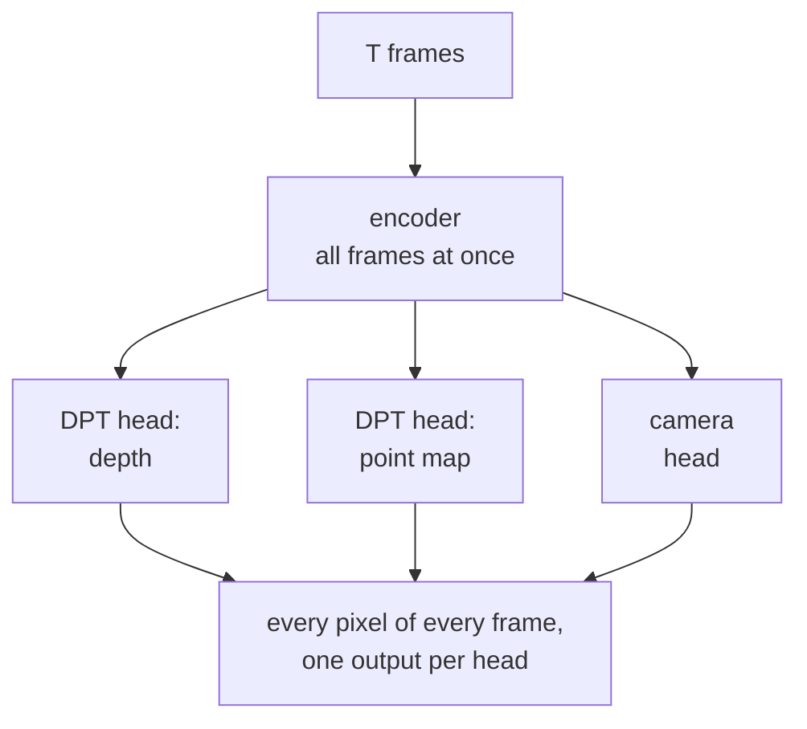
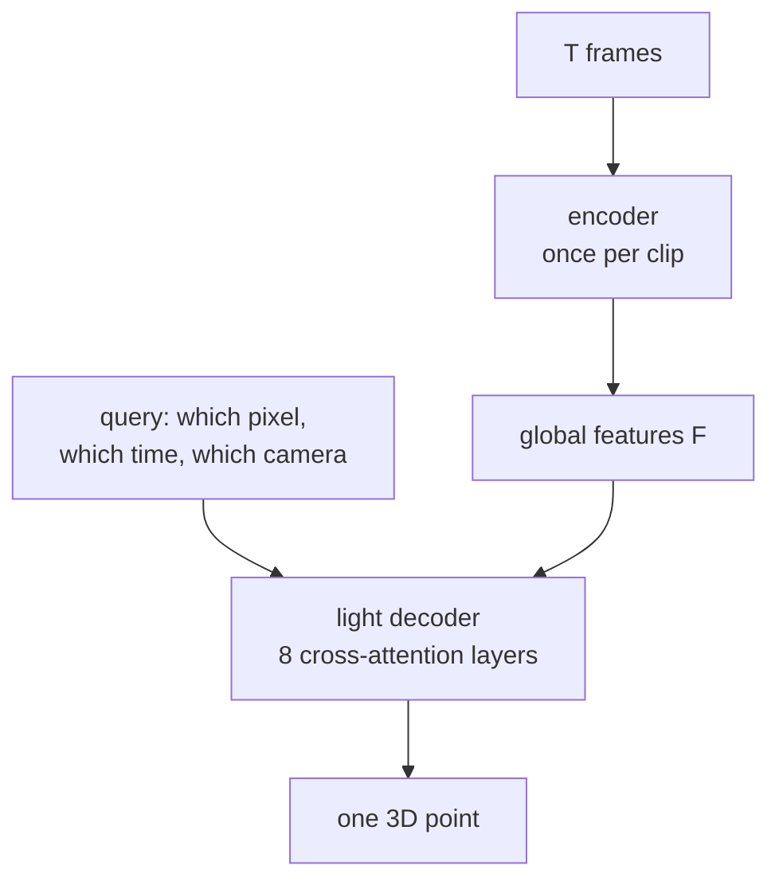
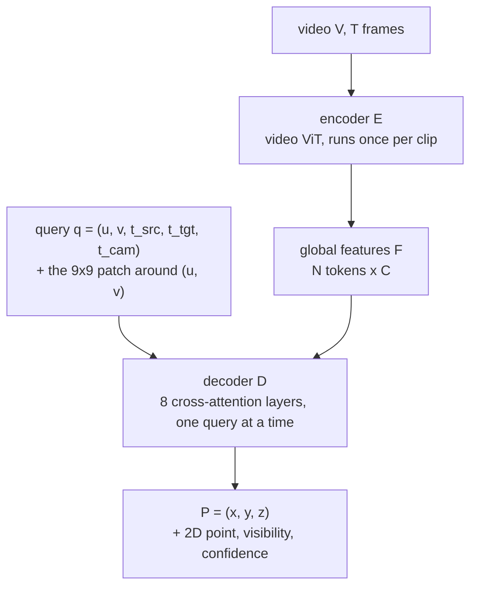
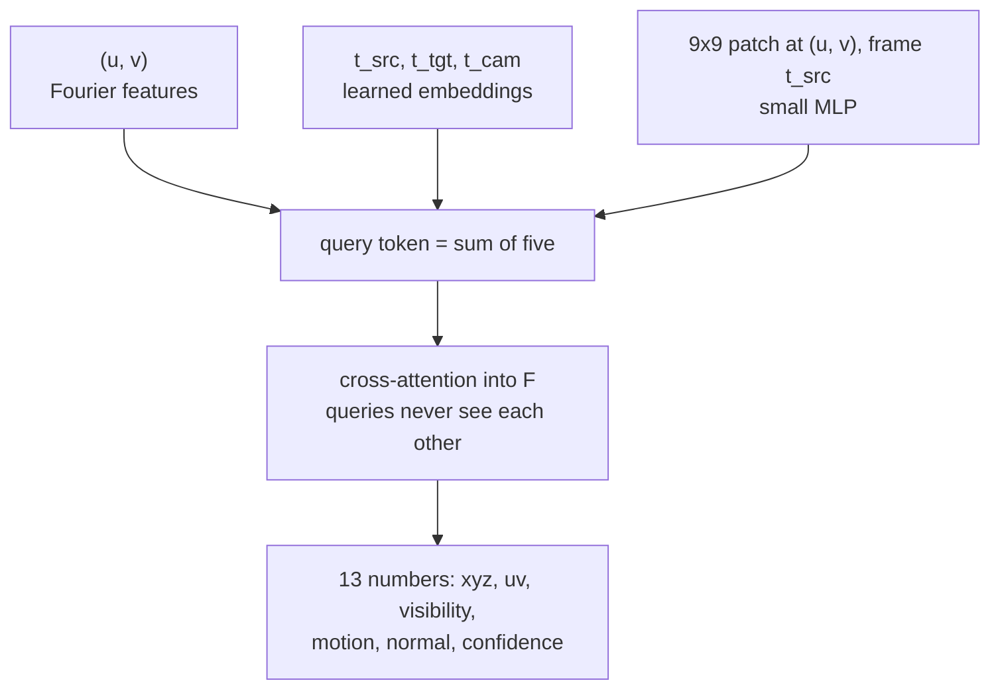
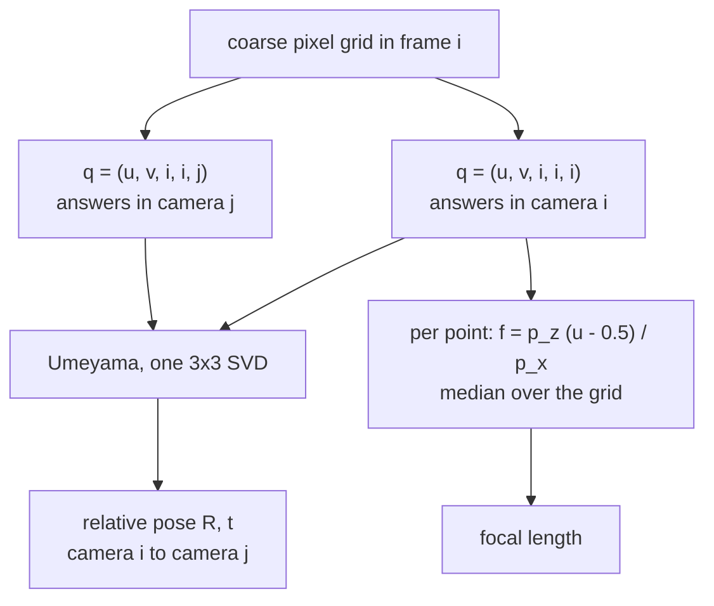
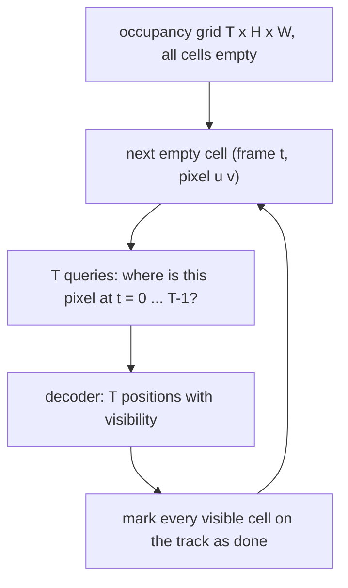
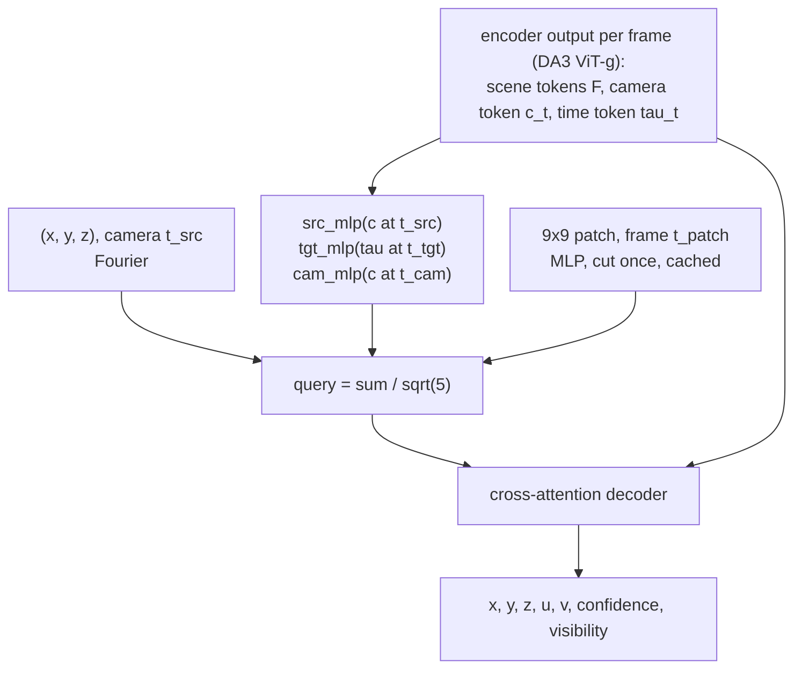
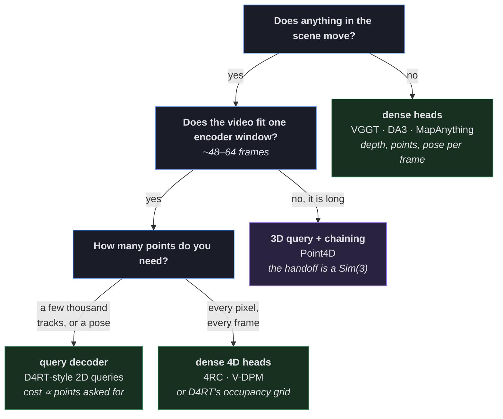

* TOC
{:toc}

# Introduction

Every feed-forward reconstruction model of the last two years has the same shape: a big transformer looks at all the frames at once (DUSt3R, VGGT, $\pi^3$, MapAnything, Depth Anything 3), then one DPT-style head per output decodes *every pixel of every frame*. Dynamic scenes expose two problems with it:

- **Nothing in the interface says "at what time".** A point map is "where is this pixel, now".
- **Everything is decoded whether you need it or not.** 3.1 M outputs per head for a 48-frame clip, even if all you wanted was one camera pose.

<figure>
  
  <figcaption style="text-align:center;color:#8b8fa3;font-size:13px">
    Reconstruction models repeat the swan or lose the flower. A tracker leaves holes. <em>Figure 4 from D4RT, arXiv:2512.08924.</em>
  </figcaption>
</figure>

[D4RT](https://arxiv.org/abs/2512.08924) (Google DeepMind, CVPR 2026 oral) proposes a different shape: **encode the video once, then answer questions about it with a small decoder, one point at a time.** The query says which point, which time, which camera.

Four parts:

1. **D4RT**: the architecture, what a light decoder buys, and what it does for a moving object, measured on four released models.
2. **Point4D** ([CMU, 2026](https://arxiv.org/abs/2609.09145)): same interface, one change to the query so that it survives long videos.
3. **Training**: which datasets, how much data, what supervision.
4. **Which one to reach for.**

# Part 1: Encode once, query anything (D4RT)

## Two shapes of a reconstruction network

Dense heads: VGGT, MapAnything, Depth Anything 3. The question is fixed by the head.

D4RT: the encoder runs once, the decoder once per question. The question is in the query.

- The heavy part, the encoder, runs once. Every question after that is one cheap cross-attention pass.
- Cost scales with **how many points you ask about**, not with $T \times H \times W$.
- A head answers one fixed question. A query can ask about another time and another camera.

## The query

$$ F = \mathcal E(V), \qquad q = (u,\, v,\, t_\text{src},\, t_\text{tgt},\, t_\text{cam}), \qquad \mathbf P = \mathcal D(q, F) \in \mathbb R^3. $$

Five numbers in, three numbers out:

| Slot | Meaning |
|:--|:--|
| $(u, v)$ | a pixel, in normalised $[0,1]^2$ coordinates |
| $t_\text{src}$ | the frame that pixel lives in |
| $t_\text{tgt}$ | the time at which you want to know where that point *is* |
| $t_\text{cam}$ | the camera whose coordinate system the answer is expressed in |

**Which slots you hold fixed turns one decoder into every 4D task:**

| Task | $u$ | $v$ | $t_\text{src}$ | $t_\text{tgt}$ | $t_\text{cam}$ |
|:--|:--:|:--:|:--:|:--:|:--:|
| Point track | fixed | fixed | fixed | $1 \dots T$ | $= t_\text{tgt}$ |
| Point cloud (one shared frame) | $1 \dots W$ | $1 \dots H$ | $1 \dots T$ | $= t_\text{src}$ | fixed |
| Depth map | $1 \dots W$ | $1 \dots H$ | $1 \dots T$ | $= t_\text{src}$ | $= t_\text{src}$ |
| Extrinsics | coarse grid | coarse grid | fixed | $= t_\text{src}$ | $1 \dots T$ |
| Intrinsics | coarse grid | coarse grid | $1 \dots T$ | $= t_\text{src}$ | $= t_\text{src}$ |

Table 1 of the paper, rewritten. "Fixed" means one value; a range means you sweep it.

## What's inside a query token

Figure 7 of the paper as a diagram. Only the first three of the 13 outputs are the point.

The 9×9 patch is not a detail:

| ViT-L on Sintel | AbsRel (scale) ↓ | ATE ↓ |
|:--|:--:|:--:|
| without the local patch | 0.366 | 0.173 |
| **with the 9×9 patch** | **0.302** | **0.091** |

Table 7 of the paper. The patch halves the pose error.

- $(u, v)$ is continuous: query at the original resolution while the encoder saw 256×256.
- **Queries never see each other**, so decoding is embarrassingly parallel. Self-attention between queries was tried: "major performance drops".

## Light decoder, heavy encoder: what it buys

<figure>
  
  <figcaption style="text-align:center;color:#8b8fa3;font-size:13px">
    A camera pose needs only a coarse grid of queries: 200+ FPS, 9× VGGT, 100× MegaSaM. <em>Figure 3 from D4RT.</em>
  </figcaption>
</figure>

| Full-video 3D tracks sustained at | 60 FPS | 24 FPS | 10 FPS | 1 FPS |
|:--|:--:|:--:|:--:|:--:|
| DELTA | 0 | 5 | 408 | 5,770 |
| SpatialTrackerV2 | 29 | 84 | 219 | 2,290 |
| **D4RT** | **550** | **1,570** | **3,890** | **40,180** |

Table 3 of the paper, single A100.

### Cameras fall out of the point sets

No camera head. Extrinsics and intrinsics are both read off answer sets.

- **Extrinsics.** The same grid of frame $i$ answered in camera $i$ and in camera $j$: one rigid transform between two point sets.
- **Intrinsics.** A grid with all three times equal, pinhole assumed: every point gives a focal length, take the median (a fisheye needs one refinement on top, see the [wide-FOV post](/blog/computer-vision/wide-fov-distortion/)).

## A point through time

A dense head answers *where is this pixel, now*. Nothing in that interface links two frames, so a moving object is a different blob in every frame and a hidden one is nothing at all. The query's $t_\text{tgt}$ slot is what changes: *where is this point at time $t$* is one decoder call, even when the point is out of sight.

Four released models on the two clips below make that difference measurable rather than argued.

<video width="100%" controls autoplay loop muted playsinline>
  <source src="/images/blog/computer-vision/query-based-4d-reconstruction/d4rt-1-per-frame-failure.mp4" type="video/mp4">
</video>

Video 1 of 2. Two toy clips, four models, one score sheet. Every picture and number is a model output.

**The clips.** A rendered world: a wall, a pillar, three posts, a floor. 80 frames each. Two balls roll to the right (radius 0.28), the yellow one far and slow, the blue one near and fast. Rendered at 768×432; the models get the same frames shrunk to 384×216 (why: the sharpness note below).

- **Clip 1, fixed camera.** Only the balls move. The blue ball overtakes the yellow one **behind the pillar**: the yellow ball is hidden in frames 14–35, the blue one in 18–30. Both stay inside the picture.
- **Clip 2, moving camera.** The same overtaking while the camera drives 4.1 units to the right. Hidden frames 14–31 and 17–27.

<figure>
  
  <figcaption style="text-align:center;color:#8b8fa3;font-size:13px">
    Clip 1: frames 0, 20, 30, 40 and 79.
  </figcaption>
</figure>

<figure>
  
  <figcaption style="text-align:center;color:#8b8fa3;font-size:13px">
    Clip 2, the same frames. The camera moves with the balls.
  </figcaption>
</figure>

**The models.** Each gets the 80 pictures and nothing else. Two of them have no tracking head, so their point tracks come from CoTracker3, lifted with the model's own depth and camera.

| | Depth Anything 3 (1.4 B) | VGGT-1B | MapAnything | Point4D |
|:--|:--|:--|:--|:--|
| Output per picture | depth, camera | depth, point map, camera | metric depth, rays, camera | a 3D point per query, at every frame |
| Point tracks | none: **+ CoTracker3** | **its own track head** | none: **+ CoTracker3** | the queries themselves |
| Resolution | 392×224 | 518×294 | 518×294 | 518×294, two chunks of 48 sharing 8 |

**Clip 1, what they returned.**

<figure>
  
  <figcaption style="text-align:center;color:#8b8fa3;font-size:13px">
    Clip 1: each dense model's 80 depth maps in one world, with its own cameras. Dashed white: the true paths.
  </figcaption>
</figure>

<figure>
  
  <figcaption style="text-align:center;color:#8b8fa3;font-size:13px">
    Clip 1, Point4D: one line per ball, over the dashed truth. Thin lines: the static queries, which should be dots.
  </figcaption>
</figure>

<figure>
  
  <figcaption style="text-align:center;color:#8b8fa3;font-size:13px">
    Clip 1 from above: each pipeline's two ball tracks over the dashed truth.
  </figcaption>
</figure>

**Clip 2, the camera moving.**

<figure>
  
  <figcaption style="text-align:center;color:#8b8fa3;font-size:13px">
    Clip 2: the same three models. All three fuse the static scene; the balls are rows of blobs again.
  </figcaption>
</figure>

<figure>
  
  <figcaption style="text-align:center;color:#8b8fa3;font-size:13px">
    Clip 2 from above. The lifted CoTracker3 tracks dip to the pillar while a ball is hidden. VGGT's track head zigzags. Point4D's lines sit on the truth.
  </figcaption>
</figure>

<figure>
  
  <figcaption style="text-align:center;color:#8b8fa3;font-size:13px">
    Clip 2, Point4D. The static queries should be dots. They streak by 0.4: the second chunk does not quite sit on the first.
  </figcaption>
</figure>

**The numbers.** One definition per metric for all four. Depth: AbsRel on the static surfaces after one global scale. Camera: ATE after placing the whole output once. Tracks: distance **outside the ball**, $\max(0,\ \lVert p - c\rVert - 0.28)$, so 0 is on or inside it. Each cell: fixed / moving camera.

| fixed / moving camera | Depth Anything 3 | VGGT | MapAnything | Point4D |
|:--|:--|:--|:--|:--|
| Depth of a frame, static AbsRel | 1.0 % / 0.4 % | 0.4 % / 1.1 % | 1.5 % / 3.1 % | 1.4 % / 5.4 % |
| Scale, true / predicted | 1.12 / 1.23 | 7.00 / 7.31 | 0.89 / 0.95 | 24.99 / 26.71 |
| Camera ATE | 0.00 / 0.14 | 0.00 / 0.11 | 0.00 / 0.42 | 0.05 / 0.76 |
| Camera motion, predicted / true (moving clip) | 1.06× | 0.94× | 0.82× | 0.80× |

| fixed / moving camera | Depth Anything 3 | VGGT | MapAnything | Point4D |
|:--|:--|:--|:--|:--|
| Point tracks from | CoTracker3 | own track head | CoTracker3 | 3D queries |
| Yellow ball, visible: outside the ball | 0.87 / 0.13 | 2.46 / 1.04 | 0.77 / 0.24 | 0.01 / 0.00 |
| Yellow ball, hidden: outside the ball | 1.55 / 1.59 | 1.62 / 1.35 | 1.58 / 1.87 | 0.05 / 0.00 |
| Blue ball, visible: outside the ball | 0.04 / 0.08 | 3.12 / 2.38 | 0.01 / 0.26 | 0.03 / 0.06 |
| Blue ball, hidden: outside the ball | 0.42 / 0.74 | 1.90 / 1.80 | 0.47 / 1.05 | 0.12 / 0.07 |
| 2D error, visible, px | 33.0 / 2.2 | 289.2 / 168.0 | 33.0 / 2.2 | 14.2 / 18.4 |
| 2D error, hidden, px | 12.0 / 2.9 | 195.6 / 134.0 | 12.0 / 2.9 | 8.0 / 18.2 |
| Static queries, drift by the last frame | - | - | - | 0.13 / 0.41 |

Yellow: far, hidden for 22 frames. Blue: near, hidden for 13, and 0.7 behind the pillar's front face. Pixels are those of the 768-wide picture.

| RTX 5080, 80 frames | Depth Anything 3 | VGGT | MapAnything | Point4D |
|:--|:--|:--|:--|:--|
| Resolution | 392×224 | 518×294 | 518×294 | 518×294 |
| Forward pass | 4.5 s | 7.2 s | 4.5 s | 13.8 s |
| 2D tracker | 0.6 s | in the pass | 0.6 s | - |
| Time to point tracks | 5.1 s | 7.2 s | 5.1 s | 13.8 s |
| Peak GPU memory | 11.7 GB | 14.1 GB | 11.8 GB | 11.5 GB |

Clip 1, one forward pass each. Point4D's backbone is Depth Anything 3 itself, run once per chunk, in bf16 to fit the card.

**What falls out.**

- **Per-frame geometry is not the problem.** All four within 1.5 % on the fixed camera, 5.4 % on the moving one; all four find the camera path (0.80–1.06×).
- **A hidden ball gets the occluder.** Every dense pipeline lifts the pillar: 1.4–1.9 outside the yellow ball. That is the pixel's answer, not a wrong answer about the ball.
- **The 2D tracker fails in the open too.** CoTracker3's yellow query comes out from behind the pillar on the blue ball (clip 1: 6 px from the blue centre, 100 px from the yellow one by the end). VGGT's track head never leaves the query pixel on clip 1 and zigzags on clip 2.
- **Point4D answers through the occlusion.** 0.05 / 0.12 outside the ball on clip 1, 0.00 / 0.07 on clip 2.
- **Point4D's weak spot is the seam.** Static queries drift by 0.13 (fixed) and 0.41 (moving), mostly after frame 40 where the second chunk of 48 starts. Part 2.
- **Point4D wants soft pictures.** On the sharp 768×432 renders its second chunk drifted by 4.25; on an antialiased 518×294, 1.37; on the 384×216 frames used here, 0.13. The dense models did not care, so every model gets the 384×216 frames.
- **It is not faster here.** 14 s against 5–7 s: its encoder is a 1.4 B backbone run once per chunk. D4RT's 200 FPS is for a pose from a few hundred queries on an A100.

## Tracking every pixel without $T^2 HW$ queries

A track for every pixel of every frame is $O(T^2 HW)$ queries. Algorithm 1 is the fix:

- Start tracks only from cells nobody has visited; every decoded track marks the cells it visibly passes through.
- Frame 0 covers most of every later frame. After that only new content spawns tracks.
- 5–15× fewer tracks in the paper; 24× on a 48-frame toy clip (165,583 tracks instead of 7.9 M).

### What D4RT buys, and what it costs

- ✅ **One decoder for everything.** Tracks, point clouds, depth, intrinsics and extrinsics are query patterns, not heads.
- ✅ **Sparse or dense at will**, at cost proportional to what you ask for.
- ✅ **Dynamic correspondence**, which none of the pure reconstruction models provide.
- ❌ **The encoder sees a whole clip at once.** Training is 48 frames; a long video has to be chunked, and the paper does not chain *tracks* across chunks.
- ❌ **The query is a pixel.** It has to be *visible* in the source frame. That breaks at a chunk boundary. Part 2.
- ❌ **No code or weights.**

# Part 2: A pixel is a bad handle for a long video (Point4D)

Any encoder has a window, so a long video becomes overlapping chunks (48 frames, 8 of overlap). Static geometry survives that: align the overlaps with a Sim(3), as VGGT-Long does. A track has an identity that has to survive the seam, and a D4RT-style decoder can only be re-asked about a *pixel*.

## A pixel or a point?

<video width="100%" controls autoplay loop muted playsinline>
  <source src="/images/blog/computer-vision/query-based-4d-reconstruction/d4rt-2-pixel-or-point.mp4" type="video/mp4">
</video>

Video 2 of 2. The same ball asked two ways: a pixel query (CoTracker3) against Point4D's point query, on both clips.

The same two clips, the same ball, asked two ways:

- **The pixel query** (CoTracker3): *where is pixel (u, v) of frame 0 in frame t?* On clip 1 the yellow query comes out from behind the pillar on the blue ball and stays there: 100 px from the yellow ball at the end, 6 px from the blue one.
- **The point query** (Point4D): *where is the 3D point under that pixel in frame t?* It carries a patch of what the point looked like, so it needs no pixel while the ball is hidden: 0.05 outside the ball in 3D.
- **Its weak spot is the seam** at frame 40, where the endpoint is handed to the second chunk as a coordinate: the static queries drift by 0.41 on the moving camera. The rest of this part is about that handoff.

<figure>
  
  <figcaption style="text-align:center;color:#8b8fa3;font-size:13px">
    Four chunks, three seams. Every pixel-query method loses the runner at one of them. <em>Figure 1 from Point4D, arXiv:2609.09145.</em>
  </figcaption>
</figure>

**Why the pixel handoff fails.** The track from chunk $k$ ends at a 3D point; to continue it you project that point into an overlap frame and ask again. Occluded: the pixel belongs to the occluder. Out of frame: there is no pixel. Visible: the projection runs through an *estimated* camera.

<figure>
  
  <figcaption style="text-align:center;color:#8b8fa3;font-size:13px">
    Left, the 2D handoff: predict, project to a pixel, re-query. Right, the 3D handoff: predict, re-query. <em>Figure 2 from Point4D.</em>
  </figcaption>
</figure>

<video width="100%" controls autoplay loop muted playsinline>
  <source src="/images/blog/computer-vision/query-based-4d-reconstruction/point4d-1-the-seam.mp4" type="video/mp4">
</video>

Point4D, video 1 of 2. Two chunks, one seam, and a pixel handoff that lands on the pillar.

## The fix: query points, not pixels

<video width="100%" controls autoplay loop muted playsinline>
  <source src="/images/blog/computer-vision/query-based-4d-reconstruction/point4d-2-point-queries.mp4" type="video/mp4">
</video>

Point4D, video 2 of 2. The handoff as a Sim(3): the endpoint crosses the seam as three numbers.

Point4D's query is

$$ q = (\mathbf p,\; t_\text{src},\; t_\text{tgt},\; t_\text{cam},\; S), \qquad \mathbf p = (x, y, z): $$

*where is the point at $\mathbf p$ (in camera $t_\text{src}$'s coordinates), whose appearance is $S$, at time $t_\text{tgt}$, in camera $t_\text{cam}$?* The slots have D4RT's names. Where each token comes from is different, and the released code shows it:

New against D4RT: a 3D point instead of a pixel, time slots built from the encoder's own tokens, a frame index for the patch. From <code>build_query_embed</code> in <code>point4d/heads/d4rt_head.py</code>.

Three things follow:

- **The point is a 3D coordinate.** Occluded and out-of-frame points are legal queries.
- **The appearance patch is cut once, where the query was born, and cached.** A point hidden in chunk 5 still carries the look it had in frame 0.
- **The handoff is a coordinate transform.** The overlap frames' predicted depth gives a Sim(3) between chunks (Umeyama on a 1024-point grid, closest 85 % of pairs). The endpoint goes through it. No pixel, no matching, no visibility requirement.

Easy to miss: Point4D **keeps Depth Anything 3's dense depth and camera heads**. The query decoder only answers *motion* questions.

## Does it work?

The ablation of the query itself, on 200-frame sequences chunked 48/8:

| Query | Dynamic Replica EPE ↓ | Survival ↑ |
|:--|:--:|:--:|
| 2D pixel (D4RT-style), reprojection handoff | 0.712 | 0.422 |
| 3D point, patch always from the source frame | 0.825 | 0.266 |
| **3D point, patch from any visible frame** | **0.155** | **0.812** |

Table 3 of the paper. Survival: how much of the video a track lasts before its first failure.

- The middle row matters. 3D coordinates *alone* do not help: a model trained only on visible source patches has never seen a query for a hidden point, and the handoff hands it exactly that. Both changes are needed.
- By what the point was doing at the handoff (Table 7): occluded points 0.57 (best pixel method) against 0.20; visible 0.29 against 0.14; out of frame 0.34 against 0.31.
- **Caveats from the same paper.** Within a single chunk Point4D is not the best decoder (4RC, V-DPM win); the gain is at the seams. Dense queries cost more than a DPT head. Everything rides on the predicted depth and the Sim(3), whose errors compound across chunks, which is exactly the drift in the table above.

> **In one line.** D4RT turned reconstruction from "decode everything" into "ask about a point"; Point4D noticed that a point should be a coordinate, not a pixel.

# Part 3: What it takes to train one

## It is not just the decoder

| | **D4RT** | **Point4D** |
|:--|:--|:--|
| Encoder | ViT-g video transformer, ~1 B params | Depth Anything 3 ViT-g, plus a time token per frame |
| Encoder initialisation | **VideoMAE** | **DA3**, including its depth head and camera decoder |
| Decoder | 8 cross-attention layers, 144 M params, from scratch | 8 cross-attention layers, from scratch |
| Encoder trained? | **Yes, end-to-end** | **Yes**, at 0.1× the learning rate |
| Released weights | none | one file of 5.8 GB, the whole network in fp32 |

- The initialisation is not optional: from random weights, D4RT's depth AbsRel goes from 0.30 to 0.74 and pose ATE from 0.09 to 0.33 (Table 11).
- The honest description: **a pretrained dense model, fine-tuned end-to-end, with a new query decoder grown on top.**

## The datasets

| Dataset | Kind | Size | Ground truth | Share of each epoch |
|:--|:--|:--|:--|:--:|
| PointOdyssey | synthetic | 159 videos, ~200 K frames | 3D point trajectories, depth, cameras | 19.8% |
| Dynamic Replica | synthetic | 524 videos, 145 K frames | long-range trajectories, depth, cameras | 19.8% |
| BEDLAM 2 | synthetic humans | 27 K sequences, ~8 M frames | SMPL-X bodies, cameras, depth | 19.8% |
| CoTracker's Kubric set | synthetic | 6 K sequences × 24 frames | point tracks with visibility | 11.9% |
| Kubric MOVi-F | synthetic | ~5 K videos × 24 frames | depth, flow, object poses, cameras | 11.9% |
| Waymo DriveTrack | **real** | ~10 K videos | 3D tracks from LiDAR and 3D boxes | 5.8% |
| OmniWorld | mixed | 600 K+ sequences | depth, cameras; **no trajectories** | 2.0% |
| ScanNet, ScanNet++, BlendedMVS, CO3Dv2 | static | large | depth, poses | 2.0% each |
| WildRGB-D | real, static | ~20 K object videos | metric poses, depth, masks | 1.0% |

Point4D's training mixture (Table 4). D4RT: a similar mixture <em>plus internal datasets</em>.

- **The dynamic data is almost all synthetic.** 83 % of an epoch is dynamic data with trajectory labels; every source is rendered except Waymo. Real video with 3D trajectory ground truth barely exists.
- **There is no self-supervision.** An L1 between the predicted point and a ground-truth point, plus small 2D, visibility (and for D4RT motion, normal) losses. What replaces it is *reuse*: static datasets declare every point a stationary trajectory.
- **The query interface is what makes the mixture usable.** OmniWorld has no trajectory labels, so its queries are restricted to $t_\text{src} = t_\text{tgt}$. Loss terms are applied only where a label exists.

## How the queries are sampled

| | **D4RT** | **Point4D** |
|:--|:--|:--|
| Queries per training clip | 2,048 per 48-frame clip | 750 per frame |
| Hard-example bias | 30 % near depth or motion edges | 40 % on Sobel edges |
| Time slots | uniform; $t_\text{tgt} = t_\text{cam}$ with probability 0.4 | uniform; $t_\text{cam} = t_\text{tgt}$ for 40 % |
| Extra weighting | confidence-weighted L1 | dynamic points upweighted |

A dense head on a 48-frame clip at 256×256 is scored on 3.1 M outputs; D4RT on 2,048 decoder calls. Supervision cost does not depend on resolution, which is also why the decoder can later be queried at full resolution.

## The recipe

| | **D4RT** | **Point4D** |
|:--|:--|:--|
| Clip length | 48 frames | 16–64 frames |
| Resolution | 256×256, with an aspect-ratio token | width sampled in [252, 518] |
| Optimiser | AdamW, wd 0.03, clip 10; warm-up 2,500 steps to $10^{-4}$, cosine | AdamW; warm-up 10 epochs to $10^{-4}$, cosine; 0.1× for DA3 parts |
| Length | 500 K steps | 150 epochs |
| Hardware | 64 TPU chips, "just over 2 days" | 8 H100 GPUs |
| Losses | $c\,\mathcal L_{3D} - 0.2\log c$ + 0.1 (2D, vis, motion) + 0.5 normal | point + conf + 2D + vis, unit weights |

## So is it light to train?

| Model | Hardware | Time |
|:--|:--|:--|
| VGGT | 64 × A100 | 9 days |
| Depth Anything 3 (giant) | 128 × H100 | ~10 days |
| **D4RT** | 64 TPU chips | ~2 days |
| **Point4D** | 8 × H100 | 150 epochs |

Yes, by a lot, but not because "only the decoder is new". The saving comes from a **pretrained initialisation** and **sparse supervision**. Point4D at eight GPUs is possible because Depth Anything 3 already paid for the 128 H100s.

## How they are evaluated

- **D4RT**, as a general reconstruction model: 3D tracking on TAPVid-3D; point clouds on Sintel and ScanNet; video depth on Sintel, ScanNet, KITTI, Bonn; pose on Sintel, ScanNet, RealEstate10K; throughput on one A100.
- **Point4D**, on the one thing it claims: long-video tracking on 200-frame PointOdyssey and Dynamic Replica and 150-frame Panoptic Studio, chunked 48/8, with end-point error, APD and survival; horizons to 500 frames; single-chunk tracking, where it is honest about not winning.
- The caveat: PointOdyssey and Dynamic Replica are also the two largest *training* sources. Most of the evidence is on held-out synthetic splits.

# Side by side

| | **Dense heads** | **D4RT: 2D query** | **Point4D: 3D query** |
|:--|:--|:--|:--|
| What the decoder is | DPT head per output | one cross-attention decoder | same decoder |
| The question you can ask | "depth / points of this frame" | "where is pixel $(u,v,t)$ at time $t'$, in camera $t''$" | "where is point $\mathbf p$ at time $t'$, in camera $t''$" |
| Dynamic correspondence | no | yes | yes |
| Cost scales with | $T \times H \times W$ | number of queries | number of queries |
| Query must be visible in the source frame? | n/a | **yes** | no |
| Chaining across chunks | align geometry with a Sim(3) | project endpoint to a pixel, re-query | transform endpoint with the Sim(3), re-query |
| Where geometry comes from | the heads | the queries | DA3's dense heads |
| Training compute | VGGT 64 A100 × 9 d; DA3 128 H100 × 10 d | 64 TPU chips × 2 d | 8 H100 |
| Code | VGGT, DA3, MapAnything | not released | released, weights on Hugging Face |

---

# Part 4: Which one should you reach for?

Static scenes never needed a query. Long dynamic videos need the query to be a 3D point.

For a few hundred frames of handheld video with people walking in and out of view:

1. **You have to chunk**, so the question is only how tracks cross the seams.
2. **The seams are where the occlusions are.** Points that never disappear would not have needed a long-video method.
3. **Point4D is the one you can run.** Same DA3 backbone as the static tools, weights on the hub, and the chaining loop is 250 lines of numpy around the model.

# References

- Zhang et al., *Efficiently Reconstructing Dynamic Scenes One D4RT at a Time*, CVPR 2026 — [arXiv:2512.08924](https://arxiv.org/abs/2512.08924) · [project page](https://d4rt-paper.github.io/)
- Jeon, Karhade, Ramanan, Tulsiani, *Point4D: Long-range 4D Motion Reconstruction*, 2026 — [arXiv:2609.09145](https://arxiv.org/abs/2609.09145) · [code](https://github.com/point-4d/Point4D) · [weights](https://huggingface.co/minsikj/point4d) · [project page](https://point-4d.github.io/)
- Sajjadi et al., *Scene Representation Transformer*, CVPR 2022 — [arXiv:2111.13152](https://arxiv.org/abs/2111.13152) (the decoder D4RT is modelled on)
- Lin et al., *Depth Anything 3: Recovering the Visual Space from Any Views*, 2025 — [arXiv:2511.10647](https://arxiv.org/abs/2511.10647) · [code](https://github.com/ByteDance-Seed/Depth-Anything-3) (Point4D's backbone; DA3NESTED-GIANT-LARGE is the model run above)
- Tong et al., *VideoMAE*, NeurIPS 2022 — [arXiv:2203.12602](https://arxiv.org/abs/2203.12602) (D4RT's encoder initialisation)
- Wang et al., *VGGT: Visual Geometry Grounded Transformer*, CVPR 2025 — [arXiv:2503.11651](https://arxiv.org/abs/2503.11651) · [code](https://github.com/facebookresearch/vggt)
- Deng et al., *VGGT-Long: Chunk it, Loop it, Align it*, 2025 — [arXiv:2507.16443](https://arxiv.org/abs/2507.16443)
- Keetha et al., *MapAnything: Universal Feed-Forward Metric 3D Reconstruction*, 2025 — [arXiv:2509.13414](https://arxiv.org/abs/2509.13414) · [code](https://github.com/facebookresearch/map-anything)
- Karaev et al., *CoTracker3: Simpler and Better Point Tracking by Pseudo-Labelling Real Videos*, 2024 — [arXiv:2410.11831](https://arxiv.org/abs/2410.11831) · [code](https://github.com/facebookresearch/co-tracker) (the 2D tracker paired with the dense models above)
- Luo et al., *4RC: 4D Reconstruction via Conditional Querying Anytime and Anywhere*, 2026 — [arXiv:2602.10094](https://arxiv.org/abs/2602.10094)
- Sucar et al., *V-DPM: 4D Video Reconstruction with Dynamic Point Maps*, 2026 — [arXiv:2601.09499](https://arxiv.org/abs/2601.09499)
- Xiao et al., *SpatialTrackerV2*, ICCV 2025 — [arXiv:2507.12462](https://arxiv.org/abs/2507.12462)
- Zheng et al., *PointOdyssey*, ICCV 2023 — [pointodyssey.com](https://pointodyssey.com/) · Karaev et al., *DynamicStereo* (Dynamic Replica), CVPR 2023 — [github](https://github.com/facebookresearch/dynamic_stereo) · Balasingam et al., *DriveTrack*, CVPR 2024 — [arXiv:2312.09523](https://arxiv.org/abs/2312.09523) · Zhou et al., *OmniWorld*, 2025 — [arXiv:2509.12201](https://arxiv.org/abs/2509.12201)
- Umeyama, *Least-squares estimation of transformation parameters between two point patterns*, TPAMI 1991

All paper figures above are reproduced from the linked arXiv preprints and are credited in their captions. Code details are from the Point4D repository at the commit current on 17 September 2026.
