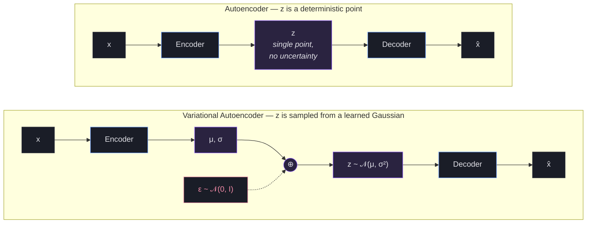

* TOC
{:toc}

This post covers **how to put a stochastic latent variable inside a neural network** --- the reparameterization trick, and what it changes about autoencoders vs Variational Autoencoders. The same machinery shows up in image generation, behavior cloning, world models, and any setting where you want a structured, sampleable latent space. The objective that makes the whole thing work --- the ELBO --- gets its own derivation in [VAE and ELBO](/blog/appendix/vae_and_elbo/).

Companion post: [VAEs to Latent Diffusion](/blog/generative-models/vaes_to_latent_diffusion/) --- once you've seen this, diffusion models are essentially "the same machine, scheduled differently."

---

## The Trick Itself

When training a model with a stochastic latent variable $z \sim \mathcal{N}(\mu, \sigma^2)$ (where $\mu$ and $\sigma$ are produced by some network), we need gradients to flow through the sampling step. But sampling is stochastic --- you can't backpropagate through randomness directly.

The **reparameterization trick** rewrites:

$$z \sim \mathcal{N}(\mu, \sigma^2)$$

as a **deterministic function** of the parameters plus external noise:

$$z = \mu + \sigma \cdot \epsilon, \quad \epsilon \sim \mathcal{N}(0, 1)$$

Now $\mu$ and $\sigma$ are deterministic operations in the computation graph, and gradients flow through them cleanly:

$$\frac{\partial z}{\partial \mu} = 1, \qquad \frac{\partial z}{\partial \sigma} = \epsilon$$

In PyTorch, this is the difference between `dist.sample()` (no gradients) and `dist.rsample()` (reparameterized, gradients flow).

<div style="position: relative; padding-bottom: 56.25%; height: 0; overflow: hidden; max-width: 100%; margin: 2em 0;">
  <iframe src="https://drive.google.com/file/d/1yqOP2Cw_PC78jlVJO7s8y0p4X0lcUCHx/preview" style="position: absolute; top: 0; left: 0; width: 100%; height: 100%;" frameborder="0" allow="autoplay; encrypted-media" allowfullscreen></iframe>
</div>

*Full animation: The Reparameterization Trick*

---

## Reparameterization in VAEs



The structural difference is in what the encoder outputs:

```
Regular AE:  x -> [encoder] -> z          (one point, no uncertainty)
VAE:         x -> [encoder] -> mu, sigma  (a whole distribution over z)
```

In a regular AE, the encoder commits to a single $z$ per input. The latent space has no structure --- nothing forces nearby points to decode to similar outputs.

In a VAE, the encoder says: *"this image $x$ could plausibly have come from any $z$ in this Gaussian neighborhood."* That's what forces the latent space to be **smooth** --- the decoder has to produce sensible reconstructions for an entire region of $z$-space, not a single point. Gaussian is the parametric choice because it's tractable, reparameterizable, and matches the prior.

```python
# VAE encoder forward pass (image VAE: 28x28 MNIST, latent_dim=32, batch=64)
mu, log_sigma = encoder(x)        # x: (B, 784)   -> mu, log_sigma: (B, 32)
sigma = log_sigma.exp()           # ensures positivity

# Reparameterization trick
eps = torch.randn_like(mu)        # eps: (B, 32), ~ N(0, I)
z = mu + sigma * eps              # z:   (B, 32) --- gradients flow through mu, sigma

# Decode
x_hat = decoder(z)                # x_hat: (B, 784)
```


The figure is the division of labor inside $z = \mu + \sigma \cdot \epsilon$:

- **$\sigma$ is learned.** The encoder outputs it per input --- "how sure am I about this image's latent?" It sets the width of the Gaussian, and gradients flow into it.
- **$\epsilon$ is not.** It's a fresh draw from $\mathcal{N}(0, 1)$ every forward pass. It knows nothing about $x$, receives no gradient, and only picks *where inside* the current Gaussian this particular sample lands.

That's also what $\partial z / \partial \sigma = \epsilon$ is saying: each sample nudges $\sigma$ in proportion to how far out in the tail that sample happened to land. Samples from the fringe of the Gaussian carry the most information about whether the spread is too wide or too narrow.

---

## What stops $\sigma$ from collapsing to zero?

Nothing in the reconstruction loss. Noise can only hurt reconstruction, so a VAE trained on reconstruction alone would learn $\sigma \to 0$ and quietly turn back into a plain autoencoder --- deterministic $z$, unstructured latent space, nothing to sample from.

What holds $\sigma$ open is the **KL term** of the ELBO, $D_\text{KL}\big[q(z \mid x) \,\|\, p(z)\big]$: it pulls every encoder Gaussian toward the prior $\mathcal{N}(0, I)$, and for a Gaussian that KL contains a $-\log \sigma^2$ term that blows up as $\sigma \to 0$. The tug-of-war between the two terms --- reconstruction squeezing $\sigma$ down, KL holding it open --- is the entire training dynamic of a VAE. The full derivation lives in [VAE and ELBO](/blog/appendix/vae_and_elbo/).

> **Key takeaway:** Reparameterization makes sampling differentiable by moving the randomness into an *input* ($\epsilon$) instead of the operation itself. The trick makes the stochastic latent trainable; the KL term is what makes the stochasticity *survive* training. Where this leads next: [VAEs to Latent Diffusion](/blog/generative-models/vaes_to_latent_diffusion/).
