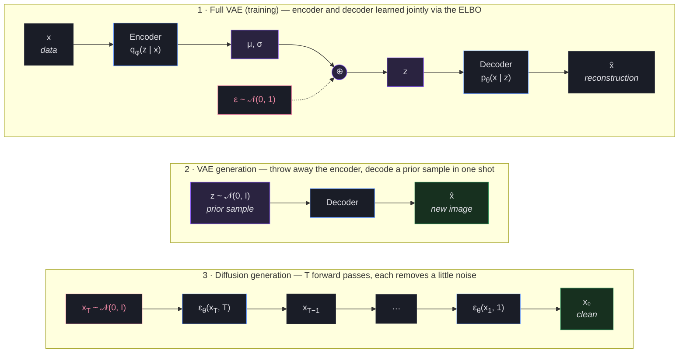
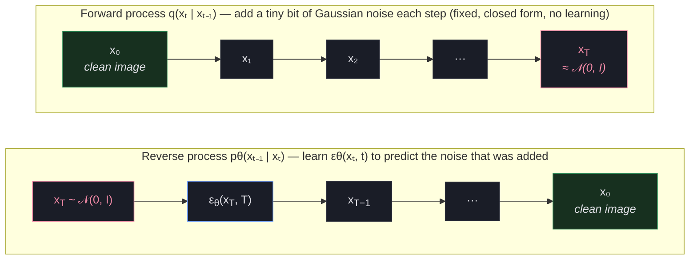
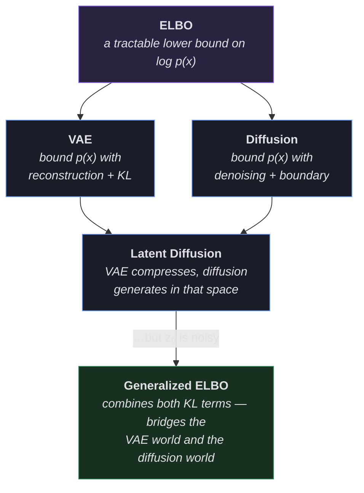

* TOC
{:toc}

*A story arc showing how one idea leads to the next, and how ELBO ties them together.*

Prerequisites: [VAE and ELBO](/blog/appendix/vae_and_elbo/) for the base derivation, and [The Reparameterization Trick](/blog/generative-models/reparameterization_trick/) for the sampling machinery. Both are assumed below.

---

**The story in four lines:**

- **VAE** — "I can't compute $p(x)$, so I'll bound it with ELBO"
- **Diffusion** — "I can't compute $p(x)$ either, but I have a different ELBO"
- **Latent diffusion** — "VAE compresses, diffusion generates in that compressed space"
- **Noisy latents** — "Wait, the VAE encoder adds noise. That breaks the math."

**Note on the literature:** ELBO for diffusion is not something we're making up. Ho et al. (2020) explicitly derive their DDPM training objective from the variational lower bound. Kingma et al. (2021) formalize continuous-time diffusion as variational inference. And Kingma & Gao (2023) show that *all* commonly used diffusion objectives are actually weighted integrals of ELBOs over different noise levels. Diffusion models can be interpreted as a special case of deep VAEs (Kingma & Gao, 2023), and the ELBO is the theoretical backbone of both.

---

## Diffusion: a different ELBO, same trick

The two machines this section compares, side by side --- a VAE generates in one decoder pass, diffusion generates by iterating a denoiser; structurally, diffusion is a hierarchical VAE whose encoder is hand-coded noise:



<div style="text-align:center;color:#8b8fa3;font-size:13px;margin:-0.5em 0 2em">Structurally, diffusion generation is a hierarchical VAE with a hand-coded encoder.</div>

### The Problem with VAEs

VAEs produce blurry images. The reconstruction loss averages over all possible $z$ values, which smooths out fine details. What if there was a different way to learn $p(x)$?

### A Different Idea: Destroy and Reverse

Instead of compressing to a latent code, gradually add noise to an image until it becomes pure static, then train a network to reverse each tiny noise step:

$$x_t = \alpha(t) \cdot x_0 + \sigma(t) \cdot \epsilon, \quad \epsilon \sim \mathcal{N}(0, I)$$



<div style="text-align:center;color:#8b8fa3;font-size:13px;margin:-0.5em 0 2em">Each tiny step is a Gaussian — easy to learn. Compose $T$ of them and you get an arbitrarily expressive distribution over images.</div>

### Diffusion Has Its Own ELBO

Here's the deep connection. Diffusion models also want to maximize $\log p(x)$, and they also can't compute it directly. So they also derive a lower bound.

**Step 1: Same starting point as VAEs.** We want $\log p(x_0)$ but can't compute it. So we introduce latent variables — except now the latents are the *entire noisy trajectory* $(x_1, x_2, \ldots, x_T)$ instead of a single $z$.

**Step 2: Apply Jensen's inequality.** Multiply and divide by the forward process $q(x_{1:T} \mid x_0)$ (which is known and fixed — just Gaussian noise injection), then apply Jensen exactly as in the VAE derivation:

$$
\begin{aligned}
\log p_\theta(x_0)
&= \log \int p_\theta(x_0, x_{1:T}) \, dx_{1:T} \\
&= \log \mathbb{E}_{q}\!\left[\frac{p_\theta(x_{0:T})}{q(x_{1:T} \mid x_0)}\right] \\
&\geq \mathbb{E}_{q}\!\left[\log \frac{p_\theta(x_{0:T})}{q(x_{1:T} \mid x_0)}\right]
\end{aligned}
$$

This is the *same structural move* as the VAE — the forward process plays the role of the encoder $q(z \mid x)$, and the latent is a whole chain $x_{1:T}$ instead of one vector $z$.

**Step 3: Decompose via the Markov property.** Both processes factorize over time:

$$
p_\theta(x_{0:T}) = p(x_T) \prod_{t=1}^{T} p_\theta(x_{t-1} \mid x_t), \qquad q(x_{1:T} \mid x_0) = \prod_{t=1}^{T} q(x_t \mid x_{t-1})
$$

Substituting these into the ELBO ratio and applying Bayes' rule to rewrite each forward step $q(x_t \mid x_{t-1}) = q(x_{t-1} \mid x_t, x_0)\, q(x_t \mid x_0) / q(x_{t-1} \mid x_0)$ (which makes consecutive terms telescope), the bound splits into per-step KL terms:

$$\text{ELBO} = \underbrace{-\sum_{t} \mathbb{E}_q\!\left[D_\text{KL}\!\left[q(x_{t-1} \mid x_t, x_0) \;\|\; p_\theta(x_{t-1} \mid x_t)\right]\right]}_{\text{denoising terms: model vs. true reverse at each step}} \;-\; \underbrace{D_\text{KL}\!\left[q(x_T \mid x_0) \;\|\; p(x_T)\right]}_{\text{boundary term}}$$

(A final reconstruction term $\mathbb{E}_q[\log p_\theta(x_0 \mid x_1)]$ at the $t=1$ boundary is typically absorbed into the denoising sum.)

Each denoising term asks: *"at step $t$, does the model's reverse step $p_\theta(x_{t-1} \mid x_t)$ match the true reverse step $q(x_{t-1} \mid x_t, x_0)$?"* Both are Gaussians with the same fixed variance $\sigma_t^2 I$, so the KL has a closed form that collapses to a plain squared distance between the predicted means:

$$D_\text{KL}\!\left[\mathcal{N}(\tilde\mu_q, \sigma_t^2 I) \;\|\; \mathcal{N}(\mu_\theta, \sigma_t^2 I)\right] = \tfrac{1}{2\sigma_t^2} \lVert \tilde\mu_q - \mu_\theta \rVert^2$$

— i.e. **MSE between means, weighted by the noise schedule.** That's why the whole training objective ends up looking like a denoising regression.

**Step 4: Simplify.** Reparameterizing $\mu_\theta$ to predict noise rather than the mean (Ho et al., 2020), and taking the continuous-time limit ($T \to \infty$), the sum becomes an integral:

$$\text{ELBO} = -\mathbb{E}_{t \sim U(0,1),\, \epsilon}\!\left[w(t) \cdot \lVert \epsilon - \epsilon_\theta(x_t, t)\rVert^2\right] \;-\; \underbrace{D_\text{KL}\!\left[q(x_T \mid x_0) \;\|\; p(x_T)\right]}_{\approx\, 0}$$

The boundary term checks whether the fully destroyed image $x_T$ looks like the prior $p(x_T) = \mathcal{N}(0, I)$. With a good noise schedule, it's essentially zero. So the entire ELBO reduces to: **teach the network to denoise at every noise level** — the simple noise-prediction MSE.

### VAE ELBO vs Diffusion ELBO — Side by Side

| | VAE | Diffusion |
|--|-----|-----------|
| Latent variables | Single $z$ | Entire trajectory $x_1, \ldots, x_T$ |
| "Encoder" | $q(z \mid x)$, learned neural net | $q(x_1, \ldots, x_T \mid x_0)$, fixed noising process |
| Main loss term | Reconstruction: $\lVert x - \hat{x}\rVert^2$ from one $z$ | Denoising: $\lVert x_0 - \hat{x}(x_t, \theta)\rVert^2$ at many noise levels |
| Regularizer | $D_\text{KL}[q(z \mid x) \,\Vert\, p(z)]$ | Boundary term $\approx 0$ |
| Why it's an ELBO | Jensen's inequality on $\log p(x)$ with latent $z$ | Jensen's inequality on $\log p(x_0)$ with latent trajectory |

### Why This Works Better Than VAEs

The VAE compresses the entire image into one latent code — a massive information bottleneck that causes blur. Diffusion does something gentler: it adds a tiny bit of noise, then asks the network to reverse just that tiny step. Each step is easy, and chaining many easy steps produces sharp images.

> **Key takeaway:** Diffusion models use a different ELBO that decomposes into a sum of denoising losses across noise levels. The forward noising process acts as the "encoder", and it's fixed (not learned). The ELBO connection is explicit in Ho et al. (2020) and formalized further by Kingma et al. (2021) and Kingma & Gao (2023).

---

## Latent diffusion: compress with VAE, generate with diffusion

### The Problem with Diffusion

Diffusion models produce beautiful images, but they're painfully slow and expensive. Every denoising step operates on the full image — all $3 \times 700 \times 700 = 1{,}470{,}000$ values. And you need 50–1000 steps.

### The Big Insight: Use BOTH

What if you used a VAE to compress the image first, then ran diffusion in the compressed latent space?

```
Standard Diffusion:
  noise (3×700×700) → denoise → denoise → ... → image (3×700×700)
  Every step: 1,470,000 values. Slow.

Latent Diffusion:
  Step 1: VAE encoder compresses image
           image (3×700×700) → z (4×64×64) = 16,384 values
  
  Step 2: Diffusion operates in latent space
           noise (4×64×64) → denoise → ... → z_clean (4×64×64)
           Every step: 16,384 values. ~90× smaller. Fast!
  
  Step 3: VAE decoder expands back
           z_clean (4×64×64) → image (3×700×700)
```

This is Stable Diffusion's architecture. The VAE handles the boring job of compressing/decompressing pixels. The diffusion model handles the creative job of generating content — but in a small, efficient space.

### How ELBO Ties It All Together

The latent diffusion model has ELBO contributions from both parts:

**VAE ELBO (Phase 1 — train the autoencoder):**

$$\text{ELBO}_{\text{VAE}} = \mathbb{E}_{z \sim q(z \mid x)}\!\left[\log p(x \mid z)\right] - D_\text{KL}\!\left[q(z \mid x) \;\|\; p(z)\right]$$

*"Can the VAE faithfully compress and decompress images?"*

**Diffusion loss (Phase 2 — freeze the VAE, train diffusion in latent space):**

$$\mathcal{L}_{\text{diff}} = \mathbb{E}_{t \sim U(0,1),\, \epsilon}\!\left[w(t) \cdot \lVert \epsilon - \epsilon_\theta(z_t, t)\rVert^2\right]$$

*"Can the diffusion model denoise in latent space?"*

Note: in Phase 2, the diffusion model operates on $z_0$ (VAE latents) instead of $x_0$ (raw pixels). Everything else is the same as the plain diffusion case above — same Jensen derivation, same Markov decomposition, same Gaussian-KL-to-MSE collapse. The diffusion-loss form above is $-\text{ELBO}_\text{diff}$ (the thing you minimize); maximize the bound, minimize the loss, same sign-flip convention as the VAE.

> **Key takeaway:** Latent Diffusion combines VAE compression with diffusion generation. Both components are justified by their own ELBO. The VAE makes things small; diffusion makes things beautiful.

---

## Noisy latents: the catch, and a generalized ELBO

### A Subtle Problem

Remember how the VAE encoder outputs a *distribution*, not a single clean point?

```
VAE encoder:  image → μ, σ → z = μ + σ · ε

z is a SAMPLE from a distribution. Every time you encode
the same image, you get a slightly different z.

This means z₀ (the "clean" starting point for diffusion)
is already a little bit noisy!
```

But the entire diffusion ELBO was derived assuming $x_0$ (or $z_0$ in latent space) is perfectly clean. When $z_0$ is itself a random sample from a distribution, the math breaks.

### What Exactly Breaks?

The diffusion ELBO decomposition:

$$\text{ELBO} = \sum_t \text{denoising KL}_t + \text{boundary term}$$

was derived for a deterministic, clean starting point. With a noisy starting point $z_0 \sim q(z \mid x) = \mathcal{N}(\mu, \sigma^2 I)$, there's an extra source of randomness the derivation didn't account for. The bound becomes loose or incorrect.

### The Fix: A Generalized ELBO

You need a generalized ELBO that accounts for the encoder distribution. The derivation is the same Jensen trick as before, but applied with the encoder *and* the diffusion forward process treated as a single joint proposal $q(z_0, z_{1:T} \mid x) = q(z_0 \mid x)\, q(z_{1:T} \mid z_0)$. Multiply and divide by it, then apply Jensen:

$$
\log p(x) \;\geq\; \mathbb{E}_{q(z_0 \mid x)\, q(z_{1:T} \mid z_0)}\!\left[\log \frac{p_\theta(x \mid z_0)\, p_\theta(z_{0:T})}{q(z_0 \mid x)\, q(z_{1:T} \mid z_0)}\right]
$$

The numerator inside the log factors into (a) a *VAE-style* decoder term $p_\theta(x \mid z_0)$ and (b) the *diffusion* trajectory $p_\theta(z_{0:T})$. The denominator factors into the VAE encoder and the (fixed) diffusion forward process. Splitting the log-ratio and applying the same Markov decomposition we used for plain diffusion gives, in loss form (negative ELBO):

$$\mathcal{L}_\text{gen} = \underbrace{-\mathbb{E}_{q(z_0 \mid x)}\!\left[\log p_\theta(x \mid z_0)\right]}_{\text{VAE reconstruction}} \;+\; \underbrace{\mathbb{E}_{t,\, \epsilon}\!\left[w(t) \cdot \lVert \epsilon - \epsilon_\theta(z_t, t)\rVert^2\right]}_{\text{diffusion denoising (same as before)}} \;+\; \underbrace{D_\text{KL}\!\left[q(z_0 \mid x) \;\|\; p_\theta(z_0)\right]}_{\text{new term: encoder vs. diffusion's } t{=}0 \text{ marginal}}$$

(Sign convention: same as the rest of the post — the ELBO has minuses in front of the recon/denoising/KL terms; the *loss* we minimize has them all as positives summed together.)

**What is the "diffusion prior at $t = 0$", i.e. $p_\theta(z_0)$?** It's the marginal distribution that the trained diffusion model implies at $t = 0$. In other words: if you run the full reverse process starting from $z_T \sim \mathcal{N}(0, I)$ all the way to $t = 0$, what distribution of $z_0$ values do you get? That's $p_\theta(z_0)$. The extra KL term checks: *"does the encoder's output distribution $q(z_0 \mid x)$ match what the diffusion model expects to see at its clean end?"*

This extra KL is the same idea as the standard VAE KL — it penalizes the encoder for producing a distribution the diffusion model isn't expecting. Only the *target* has changed: in the plain VAE, the encoder was pulled toward the simple prior $\mathcal{N}(0, I)$; here it's pulled toward the diffusion model's $t{=}0$ marginal. The circle is complete.

> **Key takeaway:** When the VAE encoder outputs a distribution (not a point), the standard diffusion ELBO needs to be generalized. The fix adds a KL term that bridges the VAE world and the diffusion world. This was formalized by Vahdat et al. (2021).

---

## Epilogue: The Thread That Connects Everything



ELBO is not just a trick — it's the theoretical backbone that makes all three frameworks possible. Every time you encounter a generative model that says "we can't compute $p(x)$ directly," the answer is almost always: derive an ELBO, find a tractable bound, and optimize that instead.

---

### References

- **Ho et al., 2020.** *Denoising Diffusion Probabilistic Models.* Explicitly derives the DDPM objective from the variational lower bound (ELBO), decomposing it into per-step KL terms.
- **Kingma et al., 2021.** *Variational Diffusion Models.* Formalizes continuous-time diffusion as variational inference, expressing the ELBO as a function of the log signal-to-noise ratio.
- **Kingma & Gao, 2023.** *Understanding Diffusion Objectives as the ELBO with Simple Data Augmentation.* Shows that all commonly used diffusion objectives equal a weighted integral of ELBOs over noise levels.
- **Vahdat et al., 2021.** *Score-based Generative Modeling in Latent Space.* Generalizes the ELBO for the case where the encoder outputs a distribution rather than a clean point.
