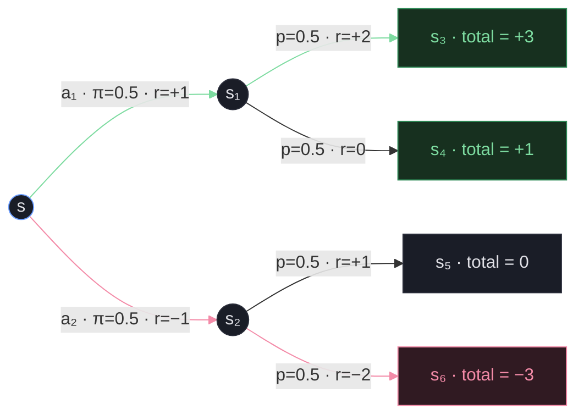
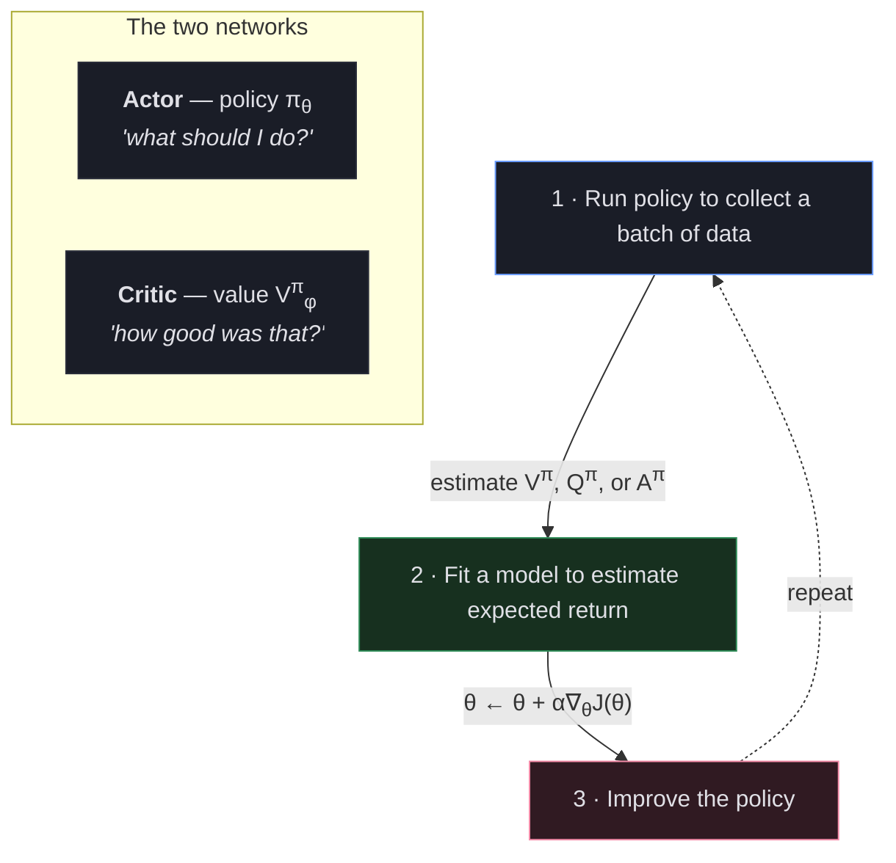

* TOC
{:toc}

# What's Wrong with Policy Gradients?

In the [previous post](/blog/reinforcement-learning/basics_2/), we built up the policy gradient with reward-to-go and baselines:

$$\nabla_\theta J(\theta) \approx \frac{1}{N} \sum_{i=1}^{N} \sum_{t=1}^{T} \nabla_\theta \log \pi_\theta(\mathbf{a}_{i,t} | \mathbf{s}_{i,t}) \left( \left( \sum_{t'=t}^{T} r(\mathbf{s}_{i,t'}, \mathbf{a}_{i,t'}) \right) - b \right)$$

The reward-to-go $\sum_{t'=t}^{T} r(\mathbf{s}_{i,t'}, \mathbf{a}_{i,t'})$ is a **single-sample estimate** of the future rewards. It's the reward we happened to get on *this particular* trajectory. But trajectories are stochastic --- different runs from the same state can produce wildly different rewards.

Consider a humanoid learning to walk. We sample 3 trajectories:

| Trajectory | What Happens | Reward-to-go at $t=0$ |
|:-----------|:-------------|:----------------------|
| $\tau^1$ | Takes one good step forward, then trips and falls backward | $+1 - 5 = -4$ |
| $\tau^2$ | Stands completely still | $0$ |
| $\tau^3$ | Stumbles forward chaotically | $+0.5 + 0.3 + 0.1 = +0.9$ |

The gradient will **push down** the probability of $\tau^1$'s first action --- even though "take a step forward" was the right move! The problem: the reward-to-go for that action was $-4$ because of what happened *later* in that trajectory, not because the action itself was bad. Meanwhile, $\tau^3$'s chaotic stumble looks like genius because the total happened to be positive.

We're judging every action by one noisy roll of the dice. What if we could *learn* how good a state actually is, averaging over many possible futures instead of relying on the one we happened to see?

---

# Value Functions and Q-Functions

Before we can build a better gradient estimator, we need two foundational concepts.

**Value function** $V^\pi(\mathbf{s})$ --- the expected total future reward starting at state $\mathbf{s}$ and following policy $\pi$:

$$V^\pi(\mathbf{s}_t) = \sum_{t'=t}^{T} E_{\pi_\theta}\left[r(\mathbf{s}_{t'}, \mathbf{a}_{t'}) \mid \mathbf{s}_t\right]$$

**Q-function** $Q^\pi(\mathbf{s}, \mathbf{a})$ --- the expected total future reward starting at state $\mathbf{s}$, taking action $\mathbf{a}$, *then* following policy $\pi$:

$$Q^\pi(\mathbf{s}_t, \mathbf{a}_t) = \sum_{t'=t}^{T} E_{\pi_\theta}\left[r(\mathbf{s}_{t'}, \mathbf{a}_{t'}) \mid \mathbf{s}_t, \mathbf{a}_t\right]$$

The difference: $V$ averages over *all* actions the policy might take from $\mathbf{s}$. $Q$ commits to a *specific* first action, then averages over the rest.

A useful relation: $V^\pi(\mathbf{s}) = \mathbb{E}_{\mathbf{a} \sim \pi(\cdot|\mathbf{s})}\left[Q^\pi(\mathbf{s}, \mathbf{a})\right]$

Let's see this concretely on a small MDP where we can compute everything exactly.



We trace all four trajectories from state $\mathbf{s}$ and average them according to their probabilities:

$$V^\pi(\mathbf{s}) = 0.5 \times \underbrace{\tfrac{(+3) + (+1)}{2}}_{\text{after } a_1} + 0.5 \times \underbrace{\tfrac{(0) + (-3)}{2}}_{\text{after } a_2} = 0.5 \times 2 + 0.5 \times (-1.5) = +0.25$$

For $Q$, we commit to a first action, then follow $\pi$: $Q^\pi(\mathbf{s}, \mathbf{a}) = r(\mathbf{s}, \mathbf{a}) + V^\pi(\mathbf{s}')$:

$$Q^\pi(\mathbf{s}, a_1) = (+1) + \big[0.5 \times (+2) + 0.5 \times 0\big] = +2.0$$

$$Q^\pi(\mathbf{s}, a_2) = (-1) + \big[0.5 \times (+1) + 0.5 \times (-2)\big] = -1.5$$

And the advantage $A^\pi = Q^\pi - V^\pi$ tells us which action beats the policy's average: $A^\pi(\mathbf{s}, a_1) = 2.0 - 0.25 = +1.75$ (push up), $A^\pi(\mathbf{s}, a_2) = -1.5 - 0.25 = -1.75$ (push down).

## From Reward-to-Go to Advantage

Now the connection to what we already know. In the previous post, we used the baseline trick:

$$\text{weight} = \underbrace{\sum_{t'=t}^{T} r(\mathbf{s}_{t'}, \mathbf{a}_{t'})}_{\text{reward-to-go}} - \underbrace{b}_{\text{baseline}}$$

The reward-to-go is a **single-sample estimate of $Q^\pi(\mathbf{s}_t, \mathbf{a}_t)$** --- one noisy trajectory out of many possible ones. And the best baseline $b$ is $V^\pi(\mathbf{s}_t)$ --- the expected return from that state. So the weight we were computing is just a noisy estimate of:

$$Q^\pi(\mathbf{s}_t, \mathbf{a}_t) - V^\pi(\mathbf{s}_t) = A^\pi(\mathbf{s}_t, \mathbf{a}_t)$$

This is the **advantage** --- "how much better was this action than what the policy would do on average?" The policy gradient becomes:

$$\nabla_\theta J(\theta) \approx \frac{1}{N} \sum_{i=1}^{N} \sum_{t=1}^{T} \nabla_\theta \log \pi_\theta(\mathbf{a}_{i,t} | \mathbf{s}_{i,t}) \, A^\pi(\mathbf{s}_{i,t}, \mathbf{a}_{i,t})$$

Adding a discount factor $\gamma$ (which down-weights far-future rewards) gives us:

$$Q^\pi(\mathbf{s}_t, \mathbf{a}_t) = r(\mathbf{s}_t, \mathbf{a}_t) + \gamma V^\pi(\mathbf{s}_{t+1})$$

$$A^\pi(\mathbf{s}_t, \mathbf{a}_t) = r(\mathbf{s}_t, \mathbf{a}_t) + \gamma V^\pi(\mathbf{s}_{t+1}) - V^\pi(\mathbf{s}_t)$$

If we had an accurate $V^\pi$, we could compute much better advantages. The question is: **how do we estimate $V^\pi$?**

---

# The Actor-Critic Idea



<div style="text-align:center;color:#8b8fa3;font-size:13px;margin:-0.5em 0 2em">The actor-critic training loop: $\nabla_\theta J(\theta) \approx \sum \nabla_\theta \log \pi_\theta(a \mid s) \cdot A^\pi(s, a)$</div>

Train **two networks**:

| Component | Role | Parameters |
|:----------|:-----|:-----------|
| **Actor** | The policy $\pi_\theta$ --- decides what to do | $\theta$ |
| **Critic** | The value function $\hat{V}^\pi_\phi$ --- judges how good things are | $\phi$ |

---

# Estimating $V^\pi$: The N-Step Return

The general form: take $n$ steps of **real rewards**, then use the critic's own estimate for the rest:

$$y_{i,t} = \sum_{t'=t}^{t+n-1} r(\mathbf{s}_{i,t'}, \mathbf{a}_{i,t'}) + \gamma^n \hat{V}^\pi_\phi(\mathbf{s}_{i,t+n})$$

Then train the critic with supervised learning:

$$\mathcal{L}(\phi) = \frac{1}{2} \sum_{i} \left\| \hat{V}^\pi_\phi(\mathbf{s}_i) - y_i \right\|^2$$

The magic is in the choice of $n$:

**When $n = 1$** (pure bootstrapping / TD learning):

$$y_{i,t} = r(\mathbf{s}_{i,t}, \mathbf{a}_{i,t}) + \gamma \hat{V}^\pi_\phi(\mathbf{s}_{i,t+1})$$

Only one step of real randomness. **Low variance** --- the target is mostly determined by the critic's smooth estimate. But **biased** --- if the critic is wrong about $\hat{V}^\pi_\phi(\mathbf{s}_{t+1})$, the target is wrong too. Early in training when the critic is clueless, this can mislead learning.

**When $n = T$** (pure Monte Carlo):

$$y_{i,t} = \sum_{t'=t}^{T} r(\mathbf{s}_{i,t'}, \mathbf{a}_{i,t'})$$

No bootstrapping at all --- just the actual observed rewards. **Unbiased** (it's the true return for that trajectory), but **high variance** (each target is one noisy trajectory out of many possible ones). This is exactly the reward-to-go we used in REINFORCE.

**When $1 < n < T$** --- the sweet spot. Use a few real rewards to stay grounded, then bootstrap to cut off the noise. Less bias than $n=1$, less variance than $n=T$. In practice, $n$ between 5 and 20 often works best.

| | Target | Variance | Bias |
|:--|:-------|:---------|:-----|
| **$n = 1$ (TD Learning / Bootstrapping)** | $r_t + \gamma \hat{V}(\mathbf{s}_{t+1})$ | Low | High (critic error) |
| **$n = T$ (Monte Carlo)** | $\sum_{t}^{T} r_{t'}$ | High | None |
| **$1 < n < T$** | $\sum_{t}^{t+n-1} r_{t'} + \gamma^n \hat{V}(\mathbf{s}_{t+n})$ | Medium | Medium |

---

# The Batch Actor-Critic Algorithm

Putting it all together, the training loop for on-policy actor-critic looks like this:

```text
Batch Actor-Critic
==================
initialize  policy π_θ ,  critic V_φ

repeat:
    # 1. roll out the current policy
    trajectories ← run π_θ for N rollouts × T timesteps

    # 2. fit the critic (bootstrapped TD target on each transition)
    for each (s, a, r, s') in batch:
        target ← r + γ · V_φ(s')
    minimize ‖V_φ(s) − target‖²    w.r.t.  φ

    # 3. estimate per-step advantage
    Â(s, a) ← r + V_φ(s') − V_φ(s)

    # 4. policy gradient (summed over the batch)
    ∇J ← Σ  ∇_θ log π_θ(a | s) · Â(s, a)
    θ  ← θ + α · ∇J
```

In code, building on the training loop from the previous post:

Compare with vanilla REINFORCE --- the only change is in step 3. Instead of reward-to-go minus a batch-average baseline, we use the critic's advantage estimate. The critic provides a **per-state baseline** instead of a **per-batch** one, which is a much better signal.

---

# Towards Off-Policy: Reusing Old Data

The algorithm above is still **on-policy** --- after each gradient step we throw away all the data and collect fresh trajectories. Can we do better?

## Multiple Gradient Steps with Importance Weights

Same idea as the [off-policy section](/blog/reinforcement-learning/basics_2/#off-policy-policy-gradients---the-data-efficiency-problem) from the previous post --- collect one batch, take multiple gradient steps, correct with importance ratios:

$$\nabla_{\theta'} J(\theta') \approx \sum_{t,i} \frac{\pi_{\theta'}(\mathbf{a}_{t,i} | \mathbf{s}_{t,i})}{\pi_\theta(\mathbf{a}_{t,i} | \mathbf{s}_{t,i})} \nabla_{\theta'} \log \pi_{\theta'}(\mathbf{a}_{t,i} | \mathbf{s}_{t,i}) \, \hat{A}^{\pi_\theta}(\mathbf{s}_{t,i}, \mathbf{a}_{t,i})$$

The surrogate objective that this gradient corresponds to is:

$$\tilde{J}(\theta') \approx \sum_{t,i} \frac{\pi_{\theta'}(\mathbf{a}_{t,i} | \mathbf{s}_{t,i})}{\pi_\theta(\mathbf{a}_{t,i} | \mathbf{s}_{t,i})} \hat{A}^{\pi_\theta}(\mathbf{s}_{t,i}, \mathbf{a}_{t,i})$$

The policy will increase probability on actions with high advantages. But **what can go wrong if we take a lot of gradient steps?** The policy is incentivized to differ significantly from the old policy --- it can overfit to the stale advantage estimates.

Two ideas to prevent this:
1. **KL constraint**: keep the new policy close to the old one --- $\mathbb{E}_{\mathbf{s} \sim \pi_\theta} \left[ D_{KL}(\pi_{\theta'} \| \pi_\theta) \right] \leq \delta$
2. **Clip the importance weights**: remove the incentive to deviate too far

The second idea leads us to PPO.

---

## Proximal Policy Optimization (PPO)

PPO is off-policy actor-critic with a few clever tricks.

### Trick 1: Clip the Importance Weights

$$\tilde{J}(\theta') \approx \sum_{t,i} \text{clip}\left(\frac{\pi_{\theta'}(\mathbf{a}_{t,i} | \mathbf{s}_{t,i})}{\pi_\theta(\mathbf{a}_{t,i} | \mathbf{s}_{t,i})}, \; 1 - \epsilon, \; 1 + \epsilon\right) \hat{A}^{\pi_\theta}(\mathbf{s}_{t,i}, \mathbf{a}_{t,i})$$

The ratio is clamped to $[1-\epsilon, 1+\epsilon]$. Once the policy has changed enough that the ratio hits the clip boundary, there's **no further gradient** --- the policy is no longer incentivized to keep deviating.

### Trick 2: Take the Pessimistic Minimum

In rare cases, clipping could accidentally *improve* the objective. Guard against this by taking the minimum of the clipped and unclipped objectives:

$$\tilde{J}(\theta') \approx \sum_{t,i} \min\left( \frac{\pi_{\theta'}}{\pi_\theta} \hat{A}^{\pi_\theta}, \; \text{clip}\left(\frac{\pi_{\theta'}}{\pi_\theta}, 1-\epsilon, 1+\epsilon\right) \hat{A}^{\pi_\theta} \right)$$

### Trick 3: Generalized Advantage Estimation (GAE)

Rather than choosing a fixed $n$ for n-step returns, GAE takes a **weighted average** over all possible n-step advantage estimates:

$$\hat{A}^{\pi}_n(\mathbf{s}_t, \mathbf{a}_t) = \sum_{t'=t}^{t+n} \gamma^{t'-t} r(\mathbf{s}_{t'}, \mathbf{a}_{t'}) - \hat{V}^\pi_\phi(\mathbf{s}_t) + \gamma^n \hat{V}^\pi_\phi(\mathbf{s}_{t+n})$$

$$\hat{A}^{\pi}_{\text{GAE}}(\mathbf{s}_t, \mathbf{a}_t) = \sum_{n=1}^{\infty} w_n \hat{A}^{\pi}_n(\mathbf{s}_t, \mathbf{a}_t)$$

The weights decay exponentially: $w_n \propto \lambda^{n-1}$. This gives more weight to short-horizon (low-variance) estimates while still incorporating long-horizon (low-bias) ones. The hyperparameter $\lambda$ controls the tradeoff.

### The Full PPO Algorithm

```text
PPO (Proximal Policy Optimization)
==================================
initialize  policy π_θ ,  critic V_φ

repeat:
    # 1. roll out the current policy
    trajectories ← run π_θ for N rollouts × T timesteps

    # 2. fit the critic
    target ← GAE target computed from rewards and V_φ
    minimize ‖V_φ(s) − target‖²    w.r.t.  φ

    # 3. compute GAE advantages
    Â_GAE(s, a) ← Σₙ  wₙ · Âₙ(s, a)           # wₙ ∝ λ^(n−1)

    # 4. snapshot the current policy (used for the importance ratio)
    π_old ← π_θ

    # 5. M gradient steps on the clipped surrogate
    for k = 1 .. M:
        ratio  ← π_θ(a | s) / π_old(a | s)
        L_clip ← E[ min( ratio · Â,  clip(ratio, 1−ε, 1+ε) · Â ) ]
        θ      ← θ + α · ∇_θ L_clip
```

Typical hyperparameters:
- ~2000 timesteps per batch
- ~10 epochs of policy updates per batch ($M \approx 300$ gradient steps with batch size 64)
- Clipping range $\epsilon = 0.2$
- ~500 iterations $\to$ 1M total timesteps

---

# Fully Off-Policy: Replay Buffers

PPO reuses each batch for a handful of gradient steps. But can we be even more off-policy --- reusing data from *all* previous batches?

Two key ideas:
- Maintain a **replay buffer** $\mathcal{R}$ of all past transitions $(\mathbf{s}, \mathbf{a}, r, \mathbf{s}')$
- Adjust equations to remove on-policy assumptions

## The Problem with $V$ and Replay Buffers

If we naively apply the on-policy actor-critic algorithm with a replay buffer, things break. The value function $V^\pi(\mathbf{s})$ depends on the *current* policy's actions, but the data in the buffer was collected by *old* policies. When we fit $V^\pi$ on old data, the targets $y_i = r_i + \hat{V}^\pi_\phi(\mathbf{s}'_i)$ use next-state values that assume the current policy generated the data --- **but it didn't**.

Similarly, the policy gradient uses $\log \pi_\theta(\mathbf{a}_i | \mathbf{s}_i)$ where $\mathbf{a}_i$ came from an old policy --- **not the action $\pi_\theta$ would have taken**.

## The Fix: Learn $Q$ Instead of $V$ (Soft Actor-Critic (SAC))

The key insight: fit $Q(\mathbf{s}, \mathbf{a})$ instead of $V(\mathbf{s})$. Since $Q$ takes the action *as input*, it doesn't matter which policy generated that action --- $Q$ just needs to predict "if I'm in state $\mathbf{s}$ and take action $\mathbf{a}$, what's the expected return?"

$$Q^{\pi_\theta}(\mathbf{s}, \mathbf{a}) = r(\mathbf{s}, \mathbf{a}) + \gamma \, \mathbb{E}_{\mathbf{s}' \sim p(\cdot|\mathbf{s},\mathbf{a}), \, \bar{\mathbf{a}}' \sim \pi_\theta(\cdot|\mathbf{s}')} \left[ Q^{\pi_\theta}(\mathbf{s}', \bar{\mathbf{a}}') \right]$$

The data in the replay buffer gives us $(\mathbf{s}_i, \mathbf{a}_i, r_i, \mathbf{s}'_i)$. The action $\mathbf{a}_i$ came from a past policy --- that's fine, it goes into $Q$ as an input. For the bootstrap target, we sample a *fresh* action $\bar{\mathbf{a}}'_i \sim \pi_\theta(\cdot | \mathbf{s}'_i)$ from the **current** policy.

The algorithm becomes:

```text
Off-Policy Actor-Critic (with Q-function)
=========================================
initialize  policy π_θ ,  Q-function Q_φ ,  replay buffer R

repeat:
    # 1. collect one transition and store it
    a ~ π_θ(· | s);  take action a;  observe (s, a, s', r)
    R.append( (s, a, s', r) )

    # 2. sample a batch from the buffer
    batch ← N transitions (s, a, r, s')  from R

    # 3. fit Q_φ  (bootstrap target uses the CURRENT policy)
    ā' ~ π_θ(· | s')                    # fresh action from the current π
    y  ← r + γ · Q_φ(s', ā')
    minimize ‖Q_φ(s, a) − y‖²    w.r.t.  φ

    # 4. policy gradient  (states from buffer, actions fresh from current π)
    â ~ π_θ(· | s)                      # fresh on-policy action
    ∇J ← (1/N) · Σ  ∇_θ log π_θ(â | s) · Q_φ(s, â)
    θ  ← θ + α · ∇J
```

Notice: in step 4, the actions $\mathbf{a}^\pi_i$ are sampled **fresh from the current policy** --- not from the replay buffer. The states $\mathbf{s}_i$ come from the buffer (old policies), but that's okay. We're optimizing the policy on a broader distribution of states, which can actually help generalization.

---

# The Off-Policy Spectrum

| Algorithm | Data Reuse | Key Mechanism |
|:----------|:-----------|:--------------|
| **REINFORCE** | None --- throw away after 1 step | On-policy, reward-to-go |
| **Batch Actor-Critic** | None --- throw away after 1 step | On-policy, learned critic |
| **PPO** | Moderate --- ~10 epochs per batch | Clipped importance ratios |
| **SAC** | Maximum --- replay buffer of all data | Off-policy Q-function |

More off-policy = more data efficient, but harder to tune and less stable. PPO is the common algorithm of choice for stable, less efficient learning (simulation is cheap). SAC and similar fully off-policy methods are preferred when data is expensive --- like real-world robotics, where SAC can learn to walk from scratch in under 2 hours.

---

# Summary

The core progression:

1. **Policy gradients** use noisy single-sample rewards to weight the gradient
2. **Actor-critic** replaces those noisy estimates with a learned value function (the critic)
3. **PPO** enables multiple gradient steps per batch with clipped importance ratios + GAE
4. **Fully off-policy (SAC)** enables learning from a replay buffer of all past experience by fitting $Q(\mathbf{s}, \mathbf{a})$ instead of $V(\mathbf{s})$

The unifying intuition hasn't changed: **estimate what is good and bad, then do more of the good stuff.** Actor-critic just makes those estimates much better.

---

*Based on notes from Stanford CS224R (Spring 2025) --- Deep Reinforcement Learning.*
